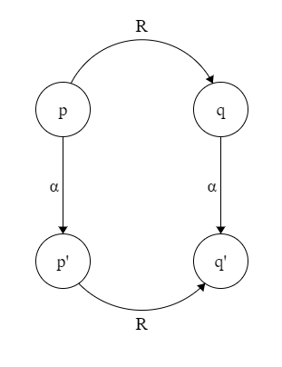

 # NOTES ON EMBEDDED SYSTEMS SAFETY
## CODE WARRIORS, TESTING MONKS, AND MANAGER ONIs
<hr>


 # BASIC CONCEPTS and DEFINITIONS:
 
**EMBEDDED SYSTEM**: An embedded system, is a system, that combines software and hardware designs. It is common, that they have some kind of HMI (human machine interface) or UI (User Interface) as displays, keyboards, et cetera. Also is quite common, at least use of one network communication protocol. Embedded systems have fixed capabilities but are programmable, and they are designed for a specific function or functions. 

Examples are: industrial equipments and control systems, production lines, machine's controllers, agricultural, automotive, train, railway, aeronautical, avionic, space and comunication systems, medical systems, household apliances, entertaiment devices, toys, vending machines, measurement/sensor and monitoring systems, security sytems, identity checks, access controls, robotics, logistics ...

Most of the times, embedded systems are **reactive**, that means that they wait for an input, or measure some propierty or signal, and when they have it, they perform some computation, or check a defined threashold or condition; and then it generates a defined output: as could be: activation of a motor, a brake, or an alarm, triggers another system, send a message ... **Than means they can be modelled as an Automata**. 

Key propierties to take into account for an embedded system are:

- Dedicated functionality
- Limited resources (the system cannot be easily expanded).
- Interaction with the enviroment.
- Performance and efficiency. (definition of the maximum work load capabilities)
- Real-time constrains (definition of the maximum reaction/response/actuation time, it also includes start-up times).
- Dependability:
     - Availability.
     - Reliability.
     - Safety.
     - Integrity.
     - Mantenebility.

**DEDICATED FUNCTIONALITY** An embedded system usually must perform a very specific function, or maybe a set of specific functions, but its design is so, that its performance is maximized for given system components, usually that implies, that it is unable to be a generalistic function system, as opposed to PC and laptops, that may do quite a big variety of functions, at the cost of being over designed. 

**LIMITED RESOURCES** An embedded system is designed to achive only the defined functions and requirements; the system only needs a certain number of resources and no more. That means in most cases, that the harware cannot be upgraded or expanded. As such, it's is also very rare that an embedded system can be designed for increase its hardware dependant capabilities, functions, or it is possible to expand its systems parts or modules. On the other hand, most of the embedded systems can be re-programmed, so its software can be changed and upgraded, that means thatt it is possible to improve the system, or adapt it to new requirements or new cases, as far as it is possible with the designed hardware.

**SAFETY**: Is the propierty of a system that evaluates, weight and analyze the risk of the ocurrence of an accident (injury or death of people), material, propierty, equipment or resources damage or losses, also enviromental degradation.

**FUNCTIONAL SAFETY** Is propierty of a systems that evaluates the safety of a system that correspond the correct actions according to the system inputs, this also includes detection of potential dangerous states or actions, and activation of protecttion, corrective or mitigation measures.

Functional safety implies _**active measures**_, as an example: the airbag systems in automotive vehicles, when a crash is detected, the safety system is triggered. On the other hand, a helmet that protects the driver, is a passive system; passive systems do not comply with the functional safety concept.

The leading standard for functional safety is the IEC 61508.

The funtional safety level of a system is evaluated with a figure of merit, known as **SIL** (Safety Integrity Level):

**SECURITY**: Is the propierty of a system that evaluates its ability to deal with malicious actions or attacks.

Take into account, that there is a significative difference between the concepts of safety and security, both terms account protection against a damage, but security implies a malicious or intended action to do a damage, while safety relates to an unintended situation.

**ACCIDENT**: The event of causing/receiving damage of any kind (either directly or indirectly): equipment damage, property damage, or damage to the enviroment, and human injuries or even deaths.

**RISK**: Combination of the likehood on an accident and its severity.   Risk = probability(accident) * severity(accident)

ISO 31000 - standards for risk management:
 - ISO 31000 - Principles and guide lines for implementation.
 - ISO 31010 - Risk management, and risk assesment techniques. 
 - ISO Guide 73 - Vocabulary

**RISK ASSESMENT**: Is the analisys to identify and determine the possible situations or conditions that may end in an accident, thus there is a thread(hazard). If the risk assesment is quantitative, it needs two factors: the Risk(R) = magnitude of the potencial lost (L) and the probability (p) that lost happens.

Ri = Li * p(Li);

**HAZARD**: Set of combinations of conditions or requisites or enviroments or events that lead to an accident

**ERROR/MISTAKE**: A human being can make an error(mistake), with results in a defect in the system(fault, bug) in the program or code, or in a document. The defect in the system, might never be noticed, or can result in the case that the system might fail its expected function (or do something it shouldnt) causing a failure. Defects in software, systems or documents can result in failures, but no all defects do.

</br>
**(human) ERROR -> (code) DEFECT -> (system) FAILURE**
</br>

**FAILURE**: A failure is the misperformance or lack of ?h?ability of a component to comply with its designed function, during certain
time, or under specified enviromental system conditions. 

**ERROR**: An error is a systematic fault: An error is a desing flaw or desviation from an intended or designed state.

>__A word about SW context__
> A human being can make an error (mistake), wich produces a defect (fault,bug) in the program, code, or in a document. If a defect in the code is executed, the system may fail to do what it must do (or do something it shouldn't) causing a failure. 

**RELIABILITY**: Is the probability that a piece of equipment or component will perform correctly its intended goal, inside the defined time, and under the correct enviroment. So Reliability is defined by the probability that for an given time interval [0,t], the systems performs ok, during all the time interval up to time t, starting working at time t=0. 

This has significative importance to systems, that perform a critical functions, or cannot be in any case replaced during service, as could be an aircraft computer. Also in systems that must work without manteinance, or cannot be easily or ever replaced, as for example: inner reactor nuclear systems, systems controlling/monitoring a blast furnace, or aerospace or satellite systems, .... 

Reliability is often quantified with the merit figure of **MTBF** (Mean Time Between Failures) 

**AVAILABILITY**: Is the probability that the system will be working/performing as expected at any given time. When calculating this parameter, it has to be taken into account: maintenace times, preventive mantenaice times and estimated time for repair (**ETR**).

Availability is commonly meanfully for those systems, where its functions can be delayed or denied for a short time period, without serius consequences.

An example of a high availability (HA) system is the electric power distribution grid (anyway hospitals, airports ... have emergency power generation systems- as fail-safe measurements because the need to be a high avaliability facilites... just in case you were worried). The GPS system, for example, is an outstandig system, as it was designed as a **zero-down-time** system.

Availability is often quantified by the merit figure of: 1-MTTR / MTTF 

where:

**MTTR** stands for Mean Time To Repair the system

and 

**MTTF** stands for Mean Time To Failure

Is also common to express availability as percentage between uptime and downtime of the system. For example a system availability 
referred as a 99% (two nines) means that over a year its downtime is 3.65 days.

**DEPENDABILITY**: Is the truthworthiness of a system so there is a justified confidence in the tasks it must perform.

Dependability is a concept that usually refers to a figure of merit that is based on:

- Reliability
- Availability
- Maintanability
- Safety
- Security 

**CRITICAL SYSTEM** Is a system that must be highly reliable, and keep this reliability even when it is developed, and evolves. 
Usually, these systems are classified into the following groups:

 - **safety critical** : the misperformance of the system would mean, personal damage or loss, or material/propierty/resources or enviromental damages Examples: Energy systes (as nuclear plants), control in transportations systems, chemical reactors, medical devices (as a pacemaker or a heart-lung assistance systems) ...
 - **mission critical**: designed to avoid total misfunction of the designed functionality or objective. example: navigation systems.
 - **bussines critical**: designed to avoid a missfunctions that would result or imply huge economic/bussines impact or material losses, usually as a result of a service interruption. Example: bank, accounting and payment systems, stock-trading systems.
 - **security critical**: designed to protect data or sensible information. example: medical databases, customers data ...

References:

https://en.wikipedia.org/wiki/Critical_system

https://en.wikipedia.org/wiki/Reliability_engineering

https://en.wikipedia.org/wiki/Redundancy_(engineering)

https://en.wikipedia.org/wiki/Factor_of_safety

https://en.wikipedia.org/wiki/Formal_methods

https://en.wikipedia.org/wiki/Z_notation

https://en.wikipedia.org/wiki/Verification_and_validation

http://czt.sourceforge.net/


https://en.wikipedia.org/wiki/Design_by_contract

https://en.wikipedia.org/wiki/Defensive_design

https://en.wikipedia.org/wiki/Fail-safe

https://en.wikipedia.org/wiki/Idiot-proof

https://en.wikipedia.org/wiki/Inherent_safety

https://en.wikipedia.org/wiki/Poka-yoke

https://en.wikipedia.org/wiki/Usability_testing

https://en.wikipedia.org/wiki/Defensive_programming

https://en.wikipedia.org/wiki/Offensive_programming

https://ulir.ul.ie/bitstream/handle/10344/2085/2010_Hinchey,M.pdf?sequence=2

https://en.wikipedia.org/wiki/Formal_verification

https://en.wikipedia.org/wiki/List_of_model_checking_tools

https://mcc.lip6.fr/

https://en.wikipedia.org/wiki/Test-driven_development

https://en.wikipedia.org/wiki/Extreme_programming

https://en.wikipedia.org/wiki/Pair_programming

https://en.wikipedia.org/wiki/Product_lifecycle

https://www.crcpress.com/Design-and-Safety-Assessment-of-Critical-Systems/Bozzano-Villafiorita/p/book/9781439803318

https://www.crcpress.com/Practical-UML-Statecharts-in-CC-Event-Driven-Programming-for-Embedded/Samek/p/book/9780750687065?source=igodigital

https://www.crcpress.com/Practical-UML-Statecharts-in-CC-Event-Driven-Programming-for-Embedded/Samek/p/book/9780750687065?source=igodigital

https://www.micrium.com/books/ucosii/

http://www.omg.org/news/meetings/workshops/RT_2002_Workshop_Presentations/01-3_Douglass_Safety_Critical_Systems_Design.pdf

https://en.wikipedia.org/wiki/Capability_Maturity_Model

http://pubs.opengroup.org/architecture/togaf8-doc/arch/chap27.html

https://en.wikipedia.org/wiki/Testing_Maturity_Model

https://en.wikipedia.org/wiki/List_of_software_reliability_models

http://www.softrel.com/truth.html

https://www.techstreet.com/ieee/standards/ieee-p1633?product_id=1914936

https://en.wikipedia.org/wiki/Quality_assurance

https://www.crcpress.com/Practical-UML-Statecharts-in-CC-Event-Driven-Programming-for-Embedded/Samek/p/book/9780750687065?source=igodigital

https://www.crcpress.com/Math-Toolkit-for-Real-Time-Programming/Crenshaw/p/book/9781929629091?source=igodigital

https://www.crcpress.com/Handbook-of-Real-Time-and-Embedded-Systems/Lee-Leung-Son/p/book/9781584886785

https://www.crcpress.com/Handbook-of-Scheduling-Algorithms-Models-and-Performance-Analysis/Leung/p/book/9781584883975

https://www.crcpress.com/Designing-Complex-Systems-Foundations-of-Design-in-the-Functional-Domain/Aslaksen/p/book/9781420087536

https://www.crcpress.com/The-Practical-Handbook-of-Genetic-Algorithms-Applications-Second-Edition/Chambers/p/book/9781584882404

https://www.crcpress.com/Differential-Equations-with-Applications-and-Historical-Notes-Third-Edition/Simmons/p/book/9781498702591?source=igodigital

https://www.crcpress.com/Introduction-to-High-Performance-Computing-for-Scientists-and-Engineers/Hager-Wellein/p/book/9781439811924?source=igodigital

https://www.crcpress.com/Embedded-Systems-Building-Blocks-Complete-and-Ready-to-Use-Modules-in-C/Labrosse/p/book/9780879306045?source=igodigital

https://www.micrium.com/books/ucosii/

http://www.sohar.com/proj_pub/download/y2ktest.pdf

**SAFE-CRITICAL SYSTEM** Is a system that under malfunction, can result in an injury or loss of a peoples life, a damage to a material propierty, or an enviroment harm.

 Safety-critical systems design involves: software, hardware and human factors.
 
 According to its reliability regimes, there are the following classifications:
 
 - **Fail-operational systems**: They continue to operate even when their control systems fail. Examples are: elevators, automotive electronic throttle control, braking systems, circuit-breakers, ..
 - **Fail-soft systems**: they continue operation with a reduced efficiency even in the presence of a failure.
 - **Fail-safe systems**: they become safe when they cannot perform its function. Medical devices, usually are found in this category, for example a heart-pump: when it cannot work, it warns the medical personal, as the safety interval, is long enough, the live of the patient is not in thread.
 - **Fail-Passive systems**: 
 - **Fault-tolerant sytems**: they continue to operate even when faults are present on the system. 
 
 Reference: https://en.wikipedia.org/wiki/Safety-critical_system
 
 TODO: SOTIF - Safety of the Intended Functionality -- ADD INFO

**FAULT TOLERANT SYSTEM**: Is a system that performs correctly, although might have some errors or faults in it. Usually this is
achieved by means of repeated computations (repetition in time), redundant systems (repetition in components), and monitoring data.

RECOVERING FROM ERRORS:
For recovering from errors there are two aproaches:

 - roll forward
 - roll back

When the systems detects an error, the *roll forward* recovery takes the system state at that point and corrects it, to be able to move forward. *Roll back* recovery revert the system state back to some earlier correct state (i.e. last checkpoint) and moves forward from there.

N-VERSION SOFTWARE:
N-version programming (NVP) or multiversion programming or multiple version dissimilar software, is a method where multiple equivalent functional programs are generated from the same especifications. The goal of this methodology is that with this the probability of identical software faults is greatly reduced. 

- [] todo: finish this

References:
https://en.wikipedia.org/wiki/N-version_programming </br>
http://ieeexplore.ieee.org/document/532621/ </br>


SELF-CHECKING SOFTWARE - Built In Self Test (BIST)
Usually an internal check of the components of the systems, helps to prevent further errors, in case some component doesn't comply with an optimal state. Thus preventing us an upcomming failure during operation of the system.

Is very common, that some hardware components include these techniques embedded in them.

http://www.eventhelix.com/RealtimeMantra/FaultHandling/hardware_diagnostics.htm#.WRoST2jyjIU </br>

EXAMPLE:

 Suppouse, you have a system, in which two tasks are working together, one of them, task_1 - senses, gadthers and updates data in real time. task_2: request that data, and do some data processing algorithm. 
 
 In the event, that for whatever reason, maybe some bug, as could be: that there aren't enough memory..., the task_1 stops on working, or performing properly, so it may report the unfriendly: segmentation fault... at that point, the task_2, should be able to detect the problem, - there are some methods to do this - and it should try to fix the system, for example, re-launching, the task_1, or reseting/rebooting the whole system in the worst case.
 
References:
https://en.wikipedia.org/wiki/Fault-tolerant_computer_system </br>
https://en.wikipedia.org/wiki/Software_fault_tolerance </br>
https://users.ece.cmu.edu/~koopman/des_s99/sw_fault_tolerance/ </br>


**ROBUST SYSTEMS** Robust systems are those, in which the computer system has the ability to cope with errors during execution and cope with erroneous inputs. Usually you test those systems with the technique of *Fault Injection*, other techniques are for example *Fuzzy testing* that involves invalid or unexpected inputs. 
<br>
<br>

## SOME CONCEPTS CLARIFICATIONS:

**Safety** is related to freedom from accidents and material/propierties/equipment damage and looses.

**Safety** is NOT **Reliability**!! Reliability is the correctness of a system performing it's intended duty/function during a consecutive period.

**Safety** is NOT **Security**!! Security is the ability to defence against intended damages and malicious actions.
<br>

**Safety** and **Availability** are DO NOT imply each other: the safest airplane, is that one never takes off... A system that is working at a given moment, doesn't imply it is safe. The opposite case, the lack of availability, also doesn't need to be true: an airbag for an automotive system, can be very safe, but once it is triggered, it is not available anymore; the triggering of the airbag, can even result on the system fallback, to block the car, due it is not safe; that is: entering a safe operation mode status, after an unexpected event that compromises the system safety. 

## SAFETY RELATED CONCEPTS:

**Accident**: It's the situation in which there is a loss of some kind: death or material damage.

**Hazard**: The set of conditions or enviromental variables, that will lead or result in an accident.
<br>

**Risk**: It's the likehood of an accident and its severity. In other words: is the figure of merit that provides a meaningful value, that allows the comparation of the risk on different cases. Its mathematical expressionn is:

R(a) = p(a) * s(a);

- R(a) is the risk of an accident 'a'
- p(a) is the probability an accident 'a' happen.
- s(a) is a factor that evaluates the overall damage, harm or loss in case on an accident 'a'. Usually the s(x) factor is defined by legal, customer or stackhorlders specifications. 

<br>

## FAILURES vs ERRORS:

**Failure**: is the non-performance of the system or component, AT RANDOM. Thus, it can be estimated from a pdf (probability density function). FAILURES ARE EVENTS.

**Error**: is a systematic fault, thus a design flaw, thus repetible. ERRORS ARE STATES.

**Fault**: A fault is either a failure or an error.


# OTHER CONCEPTS:

**DEBUGING**: locate, pin-point the root-cause and correct a defect.


# STANDARDS AND NORMATIVES:

 ## BASIC REGULATIONS:

 (EMC) Directive 2014/30/EU   - https://ec.europa.eu/growth/sectors/electrical-engineering/emc-directive_en
 
 Low Voltage Directive (LVD) (2014/35/EU) - https://ec.europa.eu/growth/sectors/electrical-engineering/lvd-directive_en
 
 Radio Equipment Directive (2014/53/EU) - https://ec.europa.eu/growth/sectors/electrical-engineering/red-directive_en

 Standard for Software Test documentation: IEEE STD 829-1998.
 
 Software Quality Product -  ISO 9126

 ## BASIC FOR SAFETY:

IEC 61508 - standard for functional safety in electric and electronic systems

EN ISO 12100 - Concepts and principles for risk assesment.
 
ISO 31000 - standards for risk management:
 - ISO 31000 - Principles and guide lines for implementation.
 - ISO 31010 - Risk management, and risk assesment techniques. 
 - ISO Guide 73 - Vocabulary
 
EN 60204-1 - Safety on Machinery - electrical equipment of machines. Part 1 : General Requirements.
 
 ## SAFETY STANDARDS:

- ISO 26262 - Automotive
- ISO 25119 - Agriculture
- ISO 13849 & IEC 62061 - Machinery
- IEC 60601 - Medical
- DO-178B - Aviation
- EN 50126 - 50128 - 50129 Railway
- IEC 61513 - Nuclear Power
- IEC 50156 - Furnaces 
- IEC 60335 - Hosehold Appliances
- IEC 61511 - Industrial Processes
- IEC 62061 & ISO 13849 - Manufacturing industry

## Others

- ISO/IEC 15288: Systems life cycle process.
- ISO/IEC 12207: - IEEE Std 12207 - Systems and software engineering - Software life cycle processes.

Recomendations to define all the tasks required for and mantaining software.
- ISO/IEC/IEE 14764 - Software maintenance
- ISO/IEC/IEE 15026 - Software assurance
- ISO/IEC/IEE 15289 - Information items (documentation)
- ISO/IEC/IEE 15939 - Measurement
- ISO/IEC/IEE 16085 - Risk management
- ISO/IEC/IEE 16326 - Project management
- ISO/IEC/IEE 24765 - Vocabulary - avaliable freely at: http://www.computer.org/sevocab
- IPC-7351: Generic Requirements for Surface Mount Design and Land Pattern Standard.
- ISO/IEC 15504: Information Technology - Process assesment, also refered as Software Process Improvement and Capability Determination (SPICE)
- Recomendations for the computer software development process and related bussines management fuctions. This standard is derived from the ISO/IEC 12207, and madurity models as CMM (Capability Madurity Model).
- IEEE 829 - software test doucmentation
- ISO/IEC 27000 - Information securty management systems.


### Aircraft systems

AC 20-115C "Airborne Software Assurance" 

RTCA DO-178C, Software Considerations in Airborne Systems and Equipment Certification

RTCA DO-330, Software Tool Qualification Considerations

RTCA DO-331, Model-Based Development and Verification Supplement to DO-178C and DO-278A

RTCA DO-332, Object-Oriented Technology and Related Techniques Supplement to DO-178C and DO-278A

RTCA DO-333, Formal Methods Supplement to DO-178C and DO-278A

http://listofavailabledocs.realviewdigital.com/?i=List%20of%20Available%20Documents-December%202017#folio=40


# SYSTEM DEVELOPMENT LIFE CICLE

There are quite a few ways for a system development project; although at least the following steps always should be considered:

 - **Analysis**:This step looks to answer and evaluate the following questions:
 
What's the problem to solve? Has it be done before? What's the function to perform? there are other non-functional features needed in the system (as user interfaces, usability, safety, security, scalability, performance, robustness ...)?, what the stackholders and interested parties expectations? What will be system enviroment? Specification and requirement of the system? Time-line and squedule of the project? Expected problems or issues that may come up? How many people does the project need to achieve the requested specifications, results, timing and goals? Evaluation of the expected project risks? Expected costs? What is the budget? Normative, contract, legal issues and laws to comply with? Do I have the skills, people and resources to do it?  

If there is significant confidence to overcome all those challenges, the the following step is -->  Definition of requirements and specifications of the system. 
 
 - **Design**: Reasoning, evaluation and design for the most fitting solution to achieve the specification, requirements and goals of the system. Consideration of problems and issues to overcome. Design of the system architecture: the different parts, modules, elements of the system. Comunications and interface between the different parts of the system. 
 
 - **Development**: Implementation of the system, an the different modules it is made of: hardware, software, ... user interface, communication protocols, power supplies, logging system, metrics of the system. Also includes the project documentation, release notes, use instructions, manuals and learning lessons.
 
 - **Testing**: Evaluation of the performance of the systems, so it can be determined if it reaches the expected goals. Validation, verification and test, riks and acceptance reports. 

# PROGRAMMING TECHNIQUES:

TODO: Desing for testeability.... write it!

## Robust programming

Robust programming is a style of programming that focus on handling unexpected terminations and unexpected actions. The code should handle those events gracefully and log or display accurate and unambigous **error mensages**, this will allow to detect and correct
much easily the pernicious event.

### Principles:

#### Paranoia
 The programmer must undestand that its code can produce bug, that make the system fail or work incorrectly. Also that the users are there to break their code. - You know the saying: *--Even paranoids have enemies--*
 
#### User-proof (aka fool-proof)
 The programmers assumes that the user at some point will use incorrect, malformed, and bogus inputs. So he has to code error-proof inputs, and emit **error mesages**, that must be: clear, specific, intuitive, unambigous, effective, detailed, explicit and that don't require to look up error codes. The message must be as accurate as possible, to the problem, so it can be detected and corrected with ease. Wrong input to the system must be always tested: the system must behave sensible even if the user don't.
 
#### Avoid Dangerous implementations

 Users should not gain access to the inners of the system/program - that is: libraries, internal states, internal values, or pointer to data structures ... The interfece with the user should be that, and be probed against loopholes.
 
 Avoid anti-patters, ie: for concurrent systems, take special care with racing conditions, priority inversions, death-locks, ... other usual suspects are architectures that relay in heabily coupled components, as oppoused to modular architectures. 

 
References:
https://en.wikipedia.org/wiki/Robustness_(computer_science)#Robust_programming </br>
http://nob.cs.ucdavis.edu/bishop/secprog/robust.html </br>

#### Coding standards and best practices

Follow recomendations for implementing the system.

- Use coding standards and recomendations:
    - meanfully comments. the code must have a good 'readability'.
    - Always define the variable inizialization values.
    - Use indentation.
    - Never ever programm an infinite loop. (under a wort case design it will block execution)
    - Never ever use magic numbers.
    - implement error handling in their own functions (so they done use up cache memory).
    - always handle input invalid values or input excptions.
    - the readability of code is important, so other people can easily understand the code, expressions as a\*b+c/d are a NO NO, the operators precedence is complicated, and parentesis shoud be used to clarify the operation: a\*(b+c)/d
- Write modular systems (loose dependancy)
- Implentent and use configuration files for the system (this will provide a flexible configuration for the future).
- Design self checking tests (for hardware control).
- Use watchdog's (sw and/or hw implemented), and/or functions/devices heartbeats.
- Implementation of recovery systems.
- Follow design and architecture patterns:
    - SOLID principles
         - Single responsability principle. (SRP).
         - Open - Closed principle.
         - Liskov substitution principle.
         - Segregation principle.
    - DRY : Don't Repeat Yourself - don't write the same code blocks over and over again, just once, and call it when needed.
    - White and black lists (for input data parsing).
    - safety and security recomendations and techniques.
    - use lint programs that advice about the coding.
    - HW patterns: ie. pulsed sources induce more EMC problems, shieldings, power supply misperformances, use DRC (design rule checks),  simulate the hardware, run montecarlo simulation analysis on the hardware, choose wisely the memory type (remember Flash, writes in blocks, and the number of writings is lower than for a EEPROM memory):
- Implement a log or trace mechanism in the system.
- Have a method to identify the software, and version of the system.
- Test functions (unit testing) with wrong, and bad data- a program should behave sensibly even if the user don't.
- Test, test, test. (it's is not the developers skill what asures a good systems (although it helps, of course!), is the test of system the action that increases the asurance on the systems capabilities, quality and confidence). (test documentation must comply wit the ieee 829 standard)

## Defensive programming

Defensive programming is a defensive coding style intended to ensure the continuing function of a program under unforeseen circunstances. This code style is usually used in systems with need high availability, safety and security. Techniques include error function handling for as much error types as possible and the use of exeptions.

### Techniques:

#### Intelligent code reuse:
Existing code is tested and is knwon to work. Reuse of it may reduce the chance of new bugs. 

 - [ ] TODO: complete this.

References: 
https://en.wikipedia.org/wiki/Defensive_programming </br>

## Inmunity-aware programming

When writing code for an embedded system, inmunity-aware programming, refers to programming techniques which improve tolerance of transient errors in the program counter or in other modules that may lead to a failure. Transient errors usually are cause for single events, as a micro-cut in the power supply or a strong electromagnetic event, transmitted from another source to our device. 

Inmunity-aware programming is an example of defensive programming and EMC-aware programming. The techniques usually are applied to the 'victim' of the emmision, to make it more reliable. 


References:
https://en.wikipedia.org/wiki/Immunity-aware_programming </br>
http://www.st.com/content/ccc/resource/technical/document/application_note/1c/6c/02/93/79/c8/4e/32/CD00004037.pdf/files/CD00004037.pdf/jcr:content/translations/en.CD00004037.pdf </br>

https://web.archive.org/web/20110524052840/http://www.conformity.com/artman/publish/printer_214.shtml </br>
http://www.nxp.com/assets/documents/data/en/application-notes/AN2764.pdf </br>


## Failure mode and effects analysis (FMEA)

 - [ ] todo: complete
 
References: 
https://en.wikipedia.org/wiki/Failure_mode_and_effects_analysis </br>


# MORE ON PROGRAMMING TECHNIQUES

As stated previously, most of the times, embedded systems are reactive, that means, they wait for an input, when they have it, they perform some computation, and then it generates an output. Than means they can be modelled as an Automata.

**OPERATIONAL SEMANTICS**: Is a category of formal programming lenguaje semantics, in which certain desired propierties of a program, such correctness, safety or security are verified by proofs of logical statements about its execution and procedures, 

**TRANSITION SYSTEM**: In computer science, a transition system is used to describe the different status of a discrete system. It consists in states, and trasitions between states.

Transitions systems differs from *Finite State Automata* in several ways:
- The set of states, is not necessarily finite, but it must be contable.
- The set of transitions, is not necessarily finite, or even countable
- Not *Start* state, or *End* state, are given.

Reference: https://en.wikipedia.org/wiki/Transition_system </br>

Formal definition:

## Transition system:
Is a pair (S,→), where S, is a set of states, and → is a set of transitions. Event where there is a transition from state **p** to state **q**, is written as: **p→q**.

## Labelled transition system (LTS):
Is a tuple (S,Λ,→), where S, is a set of states, Λ is a set of labels, and → is a set of labelled transitions.

Labels, can represent different things, depending of the context, usually they are the representation of th einput expected, or the conditions that must comply to trigger the transition. 

If for any given state *p*, and label *α*, only exits one tuple *(p,α,q)*, then it is said, that *α*, is **_deterministic_** for *p*.

## Bisimulation (or Strong Bisimulation)
Bisimulation is a relationship between state transition systems, that associates systems that behaves in the same way in the sense
*that one system simulates the other and vice versa*.

Bisimulation is important because if two systems comply with bisimulation, then it is safe to consider them as equivalent. Bisimulation
is always the safe choice.

Formal definition:
Given a LTS (labelled transition system): (S,Λ,→) a bisimulation relation is a binary relation **R**, over **S**, i.e.( **R ⊆ to S x S**) such both **R** and its inverse **R^-1** are simulations.

Equivalently **R** is a bisimulation if for every pair of elements **p**,**q** in the space of states **S**, with (p,q) in **R**, ∀ α in Λ:

  for all **p'** in **S**: p  → (α) → p'
  implies that there is a **q'** in **S**, that: q  → (α) → q 
  and (p',q') ∈ **R**

  and, simetrically:
  
  for all **q'** in **S**:  q  → (α) → q'
  implies that there is a **p'** in **S**, that: p  → (α) → p'
  and (p',q')  ∈ **R**

So given two states **p** and **q** that belong to the state space **S**, **p** is _**bisimilar**_ to **q**, and is writen as: **p ~ q**, if there is a bisimulation **R** such that **(p,q)** are in **R**.

¡if two process are bisimulation equivalents, they are equivalents from any perspective you can think of!




**THEOREM:**
Every trasition system has a _**unique**_ minimal transition system that is bisimulation equivalent to it.


## Trace of a system:
Traces, are the sequence of actions that can be executed in that system.

### Operators

- Sequence: p (dot) q or p · q ->  first p and then q
- Alternative composition: p + q -> it can happen p or q.

it is possible to combinate actios, so:  a·b + c·d

```
       / a ---> b ---> \
init <                  > --> end
       \ c ---> d ---> /
```
 - dead-lock or inaction: \delta  - it represents an action that doesn't do anything at all, and it doens't end
   - so in the case a trace is:  a · \delta -- it performs a and then \delta exectutes forever without ending
   - in the case a trace is: \delta · a -- the dead-lock stays forever and the action a never is started.
 
 - multi-actions or simultaneous actions: those are actions that happen at the same time: a | b
   - multi-actions are conmutative: a | b = b | a


## Trace equivalence
Two Transitions systems are trace equivalent if they have the same _**set**_ of traces.

### Properties of trace equivalences:

watch out! because the trace equivalence, don't conserve deadlocks.

If two states are bisimilar, then they are also trace equivalent

For deterministic trasnsition systems bisimulation and trace equivalence coincide.

### Branching bisimulation: 

-> is a bisimulation that takes hidden actions into account.

Branching bisimulation eliminates divergencies.

- All states in an invisible action (tau) loop, will be removed.


## Divergence preserving branching bisimulation.

In a state that is followed by invisible actions, its equivalent state in its bisimulated system, also will be followed by invisible actions.

## Weak trace equivalence:

Two systems are weak trace equivalens, if they have the same set of traces, where invisible actions (tau) are ommited.

- It's advantage is that this equivalence remove all the invisible actions, making an equivalent system smaller, thus easier to work with.

- It remove all the invisible actions of the behavior of the system.

- A disadvantage is that the branching structure of the system is not conserved.

Reference: https://en.wikipedia.org/wiki/Bisimulation

Reference: http://theory.stanford.edu/~rvg/abstracts.html#45

Reference: http://theory.stanford.edu/~rvg/abstracts.html

Ref: http://ai.cs.unibas.ch/papers/theses/scherrer-bachelor-12.pdf

Ref: https://www.cs.ox.ac.uk/files/6715/ICFEM%202014%20Version%2010.pdf

Ref: http://theory.stanford.edu/~rvg/


**TODO**: Check and elavorate: https://en.wikipedia.org/wiki/Calculus_of_communicating_systems

TODO: BER- Byte Error Rate --- add info.

TODO:  

- STAMP - Systems Theoretic Accident Model&Processes

<!-- https://macsphere.mcmaster.ca/bitstream/11375/11867/1/fulltext.pdf -->

TODO:

- Integrated Circuits reliability models. aging (e.g. HCI, NBTI etc) and transient (e.g. SEU, EMI etc).

<!-- 

http://ewh.ieee.org/r5/denver/sscs/Presentations/2005_02_Eaton.pdf


https://www.embedded.com/design/other/4018055/HCI-and-NBTI-Reliability-Impact-on-Submicron-IC-Design


https://www.dfrsolutions.com/hubfs/Resources/sherlock/IC-Reliability-Prediction-based-on-PoF-Models-Field-Return-Study.pdf?t=1513360245287


http://ceur-ws.org/Vol-1566/Paper1.pdf

http://www.mos-ak.org/washington_dc_2015/presentations/T05_Mohamed_Selim_MOS-AK_Washington_DC_2015.pdf

https://www.keysight.com/upload/cmc_upload/All/4-20170705.pdf

https://es.cs.uni-kl.de/publications/data/Kolh15.pdf

-->

Check, the methods, for testing: ccpcheck, vera ++, RATS, Jeckins, SonarQube, 
Test Unitarios: XUnit, CppUTest
Other sys: lcov, valgrind, ltrace, strace....

Refernece to check: Dependability through Assuredness™ (O-DA) Framework: https://www2.opengroup.org/ogsys/catalog/C13F

# OVERVIEW OF THE TESTING PROCESS:

**What is testing?:"** The test of a system is the process of evaluating the real capabilities of the system related with its desired/expected performance/behavior, and check it complies with the design requisites and expected behavior.

Another important point, is that the test process helps to find and discover issues, bugs, faults or defects that may apppear in the system. The test process is even helpful for identification of major cases or points in the system, that have been left out of the specifications or requirements, an actually need to be taken into account.

A key concept to take into account is: that **it is not the development process what asures of the quality of the system** (of course, it helps quite a lot), **is the testing process what confirms and asures the quality of the project**

-- As a disambiguation, 'test' and 'debug' are different concepts. Usually the developers are the ones that debug the system. While testers identify issues and deffects. 
**What is debuging?":** is the location, root-cause identification and fix of a defect or issue.

## WHY IS TESTING IMPORTANT?

**By testing a system behavior against its expected behavior, allows the identification of a defect in the system implementation. Once an defect is pin-pointed is then analized, corrected or fixed. As result of this action, the system is improved. Also, as a consequence, the chance that other defects, unknown issues or unexpected behaviors, remain in the system is reduced, and thus the confidence on the system is increased.**
 
The test process is of main importance in the project, due it evaluates the quality of the system, and give the stackholders, and the involved team, a sense of the expected confidence and risk level of the project. **This allows to take informed decisions and choices on the project execution, effort estimation, timelines and other project activities.**
  
## HOW MUCH TESTING IS NEEDED?

The number of test you can possibly plan for most of the systems tends to infinity. The stop point is that, in which, the asurance of the quality of the product, has been reached and checked satisfactory by the tests. Of course this level is different depending on the nature of the projet: the design of a video streamming home-appliance, usually doesn't need as much testing as the design of an emergency train brake system. 
 
## TESTING GOALS

Specifications/requirements test, checks the design is compliant with the stackholders or interested groups expectations. This often is done by means of 'test cases', where the 'tester' evaluates the action of the system for certain inputs, and compares the system outputs, actions and behavior with regart to the expected outputs.
  
  The specifications include all the 'functional' features of the system, but they can also include non-functional requiremets, as performance, usability, scalability, safety, security, availability,manteneability ...
  
  Specification testing is necesary to asure proper funtionality and behavior. But for complex or high-risk projects, it may be not nearly enoght. For example it doesn't cover a 'fool-user'. 
 
## The seven principles of testing aka the testing paradigs:

Over time, testing 'sages' have take notice of important learned leassons, and key-points to keep in mind in the test development. Those concepts are known as follows:

**1- Testing shows presence of defects** <br>
Testing, shows defects, but it cannot proof that there are not defects. Testing
increases the asurance over the system, because when a bug is found and it corrected, the chance that remaining bugs may exist, is less likely. But even in the case, that no defects can be found any further, that there is no proof that there aren't any.

**2- Exhaustive testing is impossible** <br>
test of all the possible combinations of a system is impossible. So to determine how much testing should be dont, an 
estimation of the risks, risk analysys and priorities, must be done. The testing will stop, when there is certainty that the systems complies.

**3- Early testing** <br>
Testing activities should be started as soon as possible in the system development live. (TDD - explain this!!!)

**4- Defect clustering** <br>
As following the pareto law, (it is said, that around 80% of the system faults, are caused by a 20% of the design) in many cases some components have most of the defect density. Testing should be focus to them, to maximice the effectiveness of the testing efforts.

**5- Pesticide paradox** <br>
Running the same test again and again, makes that eventually the same set of test don't find any defect at all. Having into account that some schools of thought consider a succesfull test, that one that find defects ... it's a bit, like that set of test loses "effect". 
The set of test, needs to be reviewed and updated, to exercice different parts of the system, and in different ways.

**6- Testing is context dependant** <br>
Testing depends on the context. A safe-critical system test is not at all the same that the test of a video streamming appliance.

**7- Absence of errors falacy** <br>
Even if no defects are found, it doesn't proof that the system is usable, or complies with the end-user expectations.


## TEST LEVELS

The different test at different architectural system levels, are known by different names, and its objective evaluates different system levels. The concept of the different test levels follows below. Is important to take into account, that the actual test may differ quite a lot, regarding the understanding of the system concept: for example, in an aircraft desing the system is the aeroplane, and one of its componets may be the landing system. On the other hand the landing system, is also a system by itself, and it depends on other severals components. So the key point, is that their actual test are going to be quite different, but the following descriptions, are related to the hieraquical structure of system in hands.

### UNIT TEST aka MODULE TEST also COMPONENT TESTS:

At the software level, the **unit test** is understood as a test to all the  basic functions, algorithms, classes or componentes, which checks all the possible test cases positive and negative. Usually the lowest level unit on the system architecture. Its fundamental function and behavior is evaluated, not only its corretness but it can also cover not functional aspects, as performance, robustness, usability, ... 

Unlikely the following test descriptions, this test usually is done by a developer, and it's record tends to be quite informal.
At the hardware level, it is understand as a test to determine or clarify hardware components performance.

It will be explained later in the text, bus as reference is just annotaded here. In the units test, must be covered at least:
 - correct functionallity
 - positive and negative test with valid and invalid data
 - data ranges and boundaries
 - code coverage  (percentage of the overall code in the function tested)
 - decision coverage (the flow of the program trough conditional statems, as: if, else, for, switch-case ...)
 
Depending on the system, even more things will need to be evaluated and tested.
 
### INTEGRATION TESTS:
The **integration test**, are understand as a test that looks for assesment of the performance and correct behavior between different modules, libraries or other componets in a system. It usually check the interfaces and the data workflows between them.

 Usually the following are tested at the software level
 - Interface between componets
 - Possible configurations and behavior on those configurations
 - The data workflows
 
 Once the integration level for software is done, the system integration test with the hardware platform takes place:
 
 Different strategies can be followd: Top-down, bottom-Up, functional tasks, user cases, ...
 
 The integration test, is better done incrementatlly, firstly, testing the intefeace between pair components, and increasing the number of elements/modules tested, up the point that all the componentes/modules are tested together. This allows, to identify more easily the source of a failure, due it tends to appear before, and the number of components at play, is not all the whole system.
 
 Non-functionoal characteristics, have to be tested also: as performance, ...

### SYSTEM TEST:
The **systems test** goal is to ascertain fulfillment of the system expected functions as a whole element, and also the non-functional requirements, as performance, security, safety, ... System testing checks all the external interfaces of the system under development, which is a sub-system of another system.  In the system test, the enviroment, condition and test should be as close as possible to its expected real function. So usually, the test are of the types: bussines cases, user cases.

**Important** An independent test team, should carry the system tests.

### ACCEPTANCE TEST: 
The aceptance test usually is done by the client that requested the system design or similar stackhorlders, an outside of the desing 
team labs or place. The objetive of this test, is independent evaluation of the system regarding to its designers. Usually is also quite 
useful to define functions that are outside of the defined or specified requirements. It also have a very important role, for following up and check the project milestones. 

This type of test can have serveral faces:

#### UAT: USER ACCEPTANCE TEST
Evaluates the correct behavior of the system by a bussines user. As may be the case that a data system user interfece is correct for a person that is going to use it in a bank or similar.

#### OAT: OPERATIONAL ACCEPTANCE TEST
Evaluates that the system correctly performs it's defined function by the system adimistrators.

#### REGULATION and CONTRACT ACCEPTANCE TEST
Evaluates that the system complies and achieves acceptance criteria with legal issues (govern, law, contractual, materials, safety, enviromental, emitions ...)

#### ALPHA and BETA TESTS:
Alpha testing is understand as a test done at the design team organization, but for colleages outside that team or project.
Beta testing is a test done by the customer, client or interested parties at their own locations.

TODO:

Check, the methods, for testing: ccpcheck, vera ++, RATS, Jeckins, SonarQube, 
Test Unitarios: XUnit (C# .NET) , CppUTest, googletest ...
Other sys: lcov, valgrind, ltrace, strace....

Reference to check: Dependability through Assuredness™ (O-DA) Framework: https://www2.opengroup.org/ogsys/catalog/C13F

## TEST TYPES:

### Functional testing
Functional testing  is focus on evaluation of the correctness of the system behavior, and that it perfoms as expected. It is applied to all the different test levels: unit, component, integration, system. Its usually is done by means of requirement and specification checks, but also to user cases. Is also common that it uses the black-block testing methodology.
 
### Non-functional testing
There are things aside the main functionality that also are required, those migth be: data or communitcations throughput. User interfaces, performance, usability, scalability, safety, security, robustnes, avalibility, manteanability, stress testing, portability,  .. Non-functional testing can be done at all test levels: unit, component, integration, and system. 

 - Sometimes, this the non-functioal propierties, are mapped to the ISO 9126 - Software Quality Product.

A list of non-functional characteristics:

 - usability: how easy it is to use
 - performance: if it complies with responses times and data throughput
 - security: security evaluation
 - safety: safety evaluation
 - robustness: 
 - fault-tolerance: 
 - availabilty: evaluation of the up time and down time of the system (MTBF)
 - documentation: evaluation of documentation of the system.
 - testeability: evaluation of the easiness to test the system. 
 - portability:
 - dependability:
 - scalability:
 - memory & storage: amount of memory needed, types of memory in hw (flass, eeprom, volatie)
 - data processing volume & load stress: performance under peaks of data
 - configuration: check behavior under defined configurations
 - compatibility: compatibility with defined versions
 - installation: evaluation methods
 - reliability: evaluation on the trusth of the proper behavior of the sw. 
 - recovery: evaluation of recovery methods
 - maintenance: evaluation of maintenance methods. 
 - readability: how easy is the code to read and understand (this is quite subjetive)
 
## Structure or Architectural Testing. 
It is also knwon as a **white-box** testing. Is the evaluation of some parameters of stadistics of the system behavior, as for example how complex it is (ciclomatix complexity), the number of control flow structures (if, else, for, while) and the overall of the tested code...  with the kwnoledge of its inner workings.

 - It is best used after the black-box techniques, to assert the throuroghness of the testing.

 - It can be used at all the testing levels: unit, component, integration and system levels.


## Testing related with changes: Re-testing and Regression testing (also Maintenance testing)
When doing the test sets, failded test, must be repeated to assert them, and exclude the possibility of a  possible error due to the context, conditions, enviroment, equipment used or other causes. 

On the other had, when a new part of the system is added to the development, some times that  new code, function, or component, affects other element of the system; and in the worst case, making the to fail its pourpose or expected function .... to check this possibility, a set of test, is done, so it checks previous functionalitites, in order to verify the rest of the system, keeps working fine. 

This type of testing, is usually good candidate for automation.

## TEST METHODOLOGIES AND DESIGN TECHNIQUES:

### BLACK-BOX TECHNIQUES:

Black-box techinques, refers to those test methods, that don't need to known the inner workings of the device under test. 
its is named: black-box ... because you can't see what is inside. Usually they are based and designed to evaluate the compliement of the requirements and specifications.

The most common black-box techniques are:
- Equivalence partitioning
- Boundary value analysis
- States and transition testing
- User-case testing

Also common techniques for implementing the previous tests are:
 - SIL: Software in a loop
 - HIL: Harware in a loop

#### EQUIVALENCE PARTITIONING:
The inputs to the system are classified into groups or value ranges, that have and expected equivalent response, so they are expected to be processed in the same way. This groups of values, can be for example: group of correct or valid inputs or data, group of incorrect (or not valid) inputs or data. These ranges of values, are kwnown as 'partitions'. This way the test, are designed so the check the behavior of the system for every partition. 

- Equivalence partitioning can be used in any test level. (unit, component, integration, system ...)

```
EXAMPLE:
A system has a integer numeric input and only data betwen 50 and 100 (both numbers included) is accepted as a valid data. How shoud be an equivalence partitining test designed?

The valid data is only the integer numbers that belong to [50,100], otherwise is an invalid data. Thus there is three intervals:

 - [0, 50): first partition- invalid data
 - [50, 100]:second partition- valid data
 - over 100: third partion- invalid data

So a possible test design would be to test the values: 25, 75 and 150.

The expected test results would be:

input: 25 - output: invalid
input: 75 - output: valid
input: 150 - output: invalid
```

#### BOUNDARY VALUE ANALYSIS:

Many times, for the input partitioning, the edge value, that limits between partitions, may have an incorrect behavior with respect its expected response. So the boundary values of the partitions are tested to look for defects. The boundary values of valid and invalid inputs must be tested. This methodology usually is tested at the same time that the equivalence partitioning, as they are very closely related.

- Equivalence partitioning can be used in any test level. (unit, component, integration, system ...)

Equivalence partitioning and boundary values analysis are methods, that evaluate the correct behavior of the device under test, according to the input and expected outputs. 

The design of equivalence partitioning tests, and boundary test analysis, starts from the analysys of the requirement and specifications of the system.

```
EXAMPLE:
Following with the previous example: 

A system has a integer numeric input and only data betwen 50 and 100 (both numbers included) is accepted as a valid data. How shoud be an equivalence partitining test designed?

The valid data is only the integer numbers that belong to [50,100], otherwise is an invalid data. Thus there is three intervals:

 - [0, 50): first partition- invalid data: - 50 is not included
 - [50, 100]:second partition- valid data - 50 and 100 are included
 - over 100: third partion- invalid data - 100 is not included

For testing the boundary values, a possible test would be: 49, 50, 100, 101

The expected test results would be:

- input: 49  - output: invalid
- input: 50  - output: valid
- input: 100 - output: valid
- input: 101 - output: invalid
```

#### STATES and TRANSITION TESTING:
When the system under test has to behave according to state machines or transition systems, or other similar logical or sequencial behaviors, decision tables are a good option to check that the system complies with its expected behavior. So the decision tables, specifie the triggering condition or actions that imply a state change, then all the combination of this action or events are tested. This methodolgy, often is combined, with others as: **code coverage** and **decision coverage** (these are described later in the text). 

Remember, that an Automata model, that is a state machine, can be ot two types: combinational or sequential. A combinational system, has a defined output, for the given inputs. A sequential system, uses a memory, to keep an state. More elaborate models, are the LTS systems (Lineal transition systems):


#### USER-CASE TESTS:
A test that mimics a real user scenario, is kwnow as user case test. A user-case test, aims to emulate the interaction, and common action and situations of the system under test and a normal user. User-case tests, check the data-flow and the process-flow, and how the system is likely to work.

User-cases test are specially useful to discover integration and sytem defect, because they exercice the behavior of the overall system. Also they are commonly used for acceptance tests by stackholders of the project. 

The design of the user-case test, starts **from gathering information from the stackhoders or final user**, of the expected common user interactions with the system under design.

#### SIL: Software in the Loop
   The software is tested against a model, that model reflects the requirements, specifications and expected behavior of the system. Is a method based on simulation. This method is best used at integration or system level, because with the models (logical, mathematic or physic ...) we can simulate the rest of the modules, or system elements, which makes the testing somehow easier and faster. Of course the models must be accurate, otherwise, false positives or negatives can be obtained in the test results. 
   [NOTE]... Although they have the same achronym, don't missunderstand with SIL, when it stands for: Safety Integrity Level.
   
#### HIL: Hardware in the Loop
  The hardware under test is tested, but the remain of the system or signals, or elements external to that hardware can be simulated, according to fitting models of elements. The advantage is that only the harware we are interest it is needed and the other elements of the system don't need to physically be in the test lab/facility.
  
  This is a simulation methodology, and best used at integration and system level. As with all the simulation methodologies the model must be significative enought. At the hardware level, it represents, signal propierties, response and reaction times, ...
  
  In both previous simulation techniques, a system model is used, so it must be such that it can reproduce accurately all the significant and relevant behaviours of the system.

### WHITE-BOX TECHNIQUES:

White-box techniques are those that require the kwnoledge of the inner workings of the system under test. 

For software the most common are:
 - Statement testing and statement coverage
 - Decision testing and decision coverage

#### STATEMENT COVERAGE:
Is the evaluation of the percentage of all statemenst (lines of code) which have been exercised by the testing. Usually test are designed so different code blocks can be executed, so the test suits will aim to cover and exercite as much code as possible. The account of the code executed is done by code instrumentation by means of auxiliar libraries. 

#### DECISION TESTING and COVERAGE:
This test accounts the percentage over all of different branchs exercised in the code execution (at the control flow structures: if, else, for, while ...). Tests are desiged, so different conditions are met at the different branch evaluation points. The aim is to account for as much program possible flows as possible. 

**NOTE**: A 100% decision coverage implies a 100% code coverage, but the other way around is not true: a 100% does not guarantee a 100% decision coverage.

### EXPERIENCED BASED TECHNIQUES:

In experienced based tecniques, the test are done based on the previus project experiences or knwoledge of similar systems to the one 
is under test. Similar systems and previus experience on them, allow the testers to have an intuition on the weak and strong points at the system development. 


## HARDWARE TESTING

There are test methodologies that are only applicable to the hardware of the system. Those methods aim to increase the reliability and confidence on the hardware components and subcomponets of the system.

 - HALT: Higly Accelerated life testing.
 - HASS: Higly Accelerated stress screening.
 
These two methods are complementary of each other.

HALT is used during early desing and development phases, and aims to clearly identify the hardware operating limits and fault modes at its material level. 

During the design and development phase is the best change to modify the design and the point at which will have less impact overall the project. Sometimes, some devices, don't have clear specifications, in the range we would like to use them, this might be because we are using these devices out of its common design use, o because our design goes into never explored situations...

HASS takes place in the industrialization phase, to screen hardware components, to indentify possible unidentified or lattent faults  - in practice it might just happen that a batch of a certain element, might be out of its specs, for wathever reason, ... if this is not detected in the fabrication stage, the proble will most possibly surface at the end user end, ...  As a reference is possible to look for the case of the Samsung Galaxy Note 7, that under some cases, was known to explode, allegedy due to irregularities in its batteries. It is estimated that this issues costed the firm around $5 billion. 

reference: https://www.techradar.com/news/samsung-galaxy-note-7-battery-fires-heres-why-they-exploded


Some times, the hardware supplier, might by error provide components out of its specification, ... for reasons that it cannot handle directly, it might be and innadecuate storage, or the use of base materials under its prime performane. For example during the 2010s the gold rised to a very high value, and some foundries hat to resort to other materials to make the bondings of the chips, just for these reason, the skew of the electric signals was different, and all those components hat to be re-evaluated and characterized. 

reference: https://www.eetimes.com/document.asp?doc_id=1257340


These methods are used for IDENTIFICATION and CORRECTION of possible or eventual faults at the hardware component level.


## TEST PROCESS STEPS and ACTIVITIES

At the testing context, the first action to do, is to define the **Test Plan** for that, several key points have to
be defined:

 - Test planning and control
 - Test analysis and design
 - Test implementation and execution
 - Exit criteria, evaluation and reports.
 - Test clousure and activities.
 
 
### Test planning and control 

 **Test planning** Definition and plan of the actions to perform, time-line, team, equipment, facilities and tools needed, that aims to define the objectives of the testing, and the needed actions and resources to achieve those objectives.
 
 </br> </br>
 
 **Test design and analysis**
At this step, tests for evaluation of the system are designed,(actions, contexts, enviroments and expected results) and defined the objetives they want to ckeck.

This include go through the following points:

- Review requirements, system integrity level (that is compliance with some system parameters previously defined as software complexity, risk assesment, safety and security level, performance, reliability, cost ... Usually these points are defined by the stakeholders):
- Evaluation the testability of the test basis and test objects.
- Identify and priority test conditions based on the overall project.
- Design and prioritaze high level tests.
- Identify necessary test data and resources. (who provides correct input data?)
- Design and define the test enviroment, platform, equipment, tools and required infraestructures and materials.
- Create a method to a bidirectional traceability between test basis and test cases and requirements.

 </br> </br>
 
 **Test control**: Testing activities must be monitored through the project. It is the comparation between the state of the project, against the expected planned result. It also covers the **report** of the testing status, including desviations and non-conformances  from the plan. Also include proposals to the actions that need to be done, in order to meet again the goals, and expectations of the project. 
 
So **test control** is related to guide the corrective actions taken as a result of information or metrics. These actions can be applied to any part of the system.

Examples of test control actions are:

- Take decisions based on the information from test monitoring, evaluation and test results:
- Repriorinzing tests, and identification of potential risks (need of more team members, need of more equipment, or additional tools ...)
- Change of the test squedule, based on the abailability of equipment or facilities.
- Setting the criteria about re-testing issues, for including those modifications into the system build.
- trace test done versus the requirements they check.

 </br> </br>
 
## Test implementation and execution

The designed test procedures are implemented, and a certain execution sequence for the tests has to be defined in order to run the set of test (usually according to priority). When the test platform and enviroment is set up, the test cases are run, executed, and evaluated.

The objetive and goals of the text execution is:

- Implementation, and definition of the expected results, and execution order and priority of the test cases.
- develop test procedures, create test data, optionally preparing test hardeness and writting automating test scripts.
- creation of test suits, for efficient test execution.
- verification that the test enviroment has been set up properly.
- verification and update if needed, of bi-directional trazability between the test cases and requeriments.
- Execution of the test, according to the test procedure. Log of the test execution relevant information, as identification of the
different elements involved, as system version: , software and hardware version, prototype identification, tools, device under test, execution time, and other significant data needed.
- definition of the test trazability to the requirements it checks.
- Definition of the criteria for comparation and evaluation of the test with the expected results.
- Repeat test that failed out of the expected results to confirm the issue, and gather new information details if possible. check if the 
efect is always reproducible, or it is sporadic....
- Record and logging of the tests results, significant test conditions, enviroment or other data that may be userful. 
- If new issues are found, _regression testing_ (test all the system to asure that new code or components haven't affected the rest of the developed system) may be advisable, to check that new issues has not appear in other stable parts of the systems.
- Report discrepancies with the expected results, outliers, incidents, and misperformances, or unexpected issues and analyse them in order to identify a possible root-cause. (defect in the code implementation, invalid input data or conditions (as could be: data out of bounds, damaged equipment, wrong procedure, ...)
- the test documentatinos must be according to the "Standard for Software Test documentation": IEEE STD 829-1998.

 </br> </br>
 
 
### Test results (Exit criteria, evaluation and reports.).

- Evaluation: the data obtained from the test should be compared with the expected results.
- Report of the failed test!!!
- Modification over the test, or expected results should be planned.
- Reports should be done for the stackholders, and system team members.
- The test documentatinos must be according to the "Standard for Software Test documentation": IEEE STD 829-1998.

### Test plan clousure activities.
 
At the end of the project, or at project milestones, certain activites are to be observed:
 
 - Report of the system acceptance.
 - review and learned lessons.
 - project metrics, and evaluation of the testware.
 
https://en.wikipedia.org/wiki/Testing_Maturity_Model

### Test plan document index example guide:

As always, the test documentation must be according to the "Standard for Software Test documentation": IEEE STD 829-1998.


| iNDEX  | . | Description|
| :---:|     :---:      |          :--- |
| 1   | Presentation    |  Date of release, document version, document owner, approvals    |
| 2   |      | Introduction, presentation, motivations, overview and background of the project and the system |
| 3   |      | Document identification, objetives, goals, scope (this is the test plan document for XX project, and it explains the test plan for YY, intended for the system version ZZ, according to requirements version RR ...) and document history, and related needed documents (as normative, release notes, system version, system documentation, requirements document version).    |
| 4   |      | Testing team, responsabilities and roles    |
| 5  |      | References (list of normative elements, manuals, procedures, application notes, agreements, notes, ...)   |
| 6 |      Test Process      | Test goals and tasks  |
| 7 |        | List of documents, description and formats to use at the test process |
| 8  |       | Asumptions and enviroments (hardware platform, operating system, applications, ...)   |
| 9  |      | Features to be tested   |
| 10  |      | Features to not be tested    |
| 11   |      | Dependencies and resposabilites    |
| 12   |      | test Tools, equipment, software, resources and facilities    |
| 13   |       | Test strategy  (how are de test cases are designed)   |
| 14|       | Test process squedule (time for analysis and design, timeline test process, control points, deliverables, current and future expected events or needs)   |
| 15   |       | Test data generation (where the test data is comming from, does the customer or an specialist provide it? is it good enought data (relevant, accurate and significative) ?)    |
| 16   |       | Unit tests  (procedures, cases, objetives, goals, requirements, trazability, input data, **expected data**): functionalities tested, and its associated requirements. Positive and negative input value data and ranges. Code and condition coverage. |
| 17   |       | Integration tests   (procedures, cases, objetives, goals, requirements, trazability, input data, **expected data**)  |
| 18   |       | System test  (procedures, cases, objetives, goals, requirements, trazability, input data, **expected data**)   |
| 19  |       | Non-functional test (performance, escalability, interface, usability, safety, robustness, availability,  ...)   |
| 20   |       | Traceability test-requirements and specifications |
| 21   |       | Minimun set of test to execute to evaluate viability of a new version release (test basic functions and safety/security concerns).    |
| 22   |      | Regression testing    |
| 23  |       | Automated testing   |
| 24  |       | Batch testing (automated regression testing)   |
| 25  |       | Metrics to take into account  |
| 26  |       | Control and monitoring points, milestones and procedures (report formats and expected information and data, risks reports and change requests.  |
| 27   |      | Risks (possible risks for the project, as lack of resources, time deliveries overdue, lack of man-power, lack of quality test data, future preditions, problems to overcome or concerns   ...)    |

 <!-- http://www.softwaretestinghelp.com/test-plan-sample-softwaretesting-and-quality-assurance-templates/  -->

## TEST TECHNIQUES:
  
### Software: Dynamic vs Static testing

When a test case of a system involves the actual run of the system, this is known as 'dinamic testing', on the other hand when it doens't inolve the run of the sysem is known as 'static testing'.

 - Dinamic testing usually makes us of stubs/drivers, execution from a debugger enviroment. And is also quite common to automate it.
 
Static testing, is referred to those evaluations that don't need the system to be running. Those are techniques as: code review, revision, walkthoruhgs, inspection, and alsouse of programs that automatically ckeck the code propierties (as could be: detection of 'dead code' (code that will never execute)unused variables, missing pointers, out of bound arrays, wrong types varaible asignations, lost of precission in mathematical operations, ...) 

### Static Techniques:

 Static techniques are based on the evaluation and analysis of the code, of the system, documentation, requirements or desing especifications, test plan, test cases, test scripts, without the execution of the code, also any other related work can be evaluated as, the  This is opposed to the dynamic testing, which relates to the actual run of the system and code. For example: a revision can find requirements issues, that are much more harder to pinpoint in dynamic testing.
 
 This is an important medhod and can be done well before the dynamic test execution.The advantages of the defect detectections at an early point in the project live include early correction, increase of productivity, reduction of development times, cost of testing, 

A very common tool for static checking is the program "cppcheck". that is open source and also can check for CERT and MISRA standards.

references:
- https://sourceforge.net/projects/cppcheck/
- http://cppcheck.sourceforge.net/manual.pdf

#### Review Process:
There are several levels of review procoess depending on how formal they are done. the way the revision is carried out depends on its objectives: gain understanding of the system, presentation of the sistem, introduction to new team mebers to the system, or even an auditory.

##### Types of review

##### Informal review
- There is no formal process
- May be part of pair programming, or technical review of design, code, or architecture
- Results may be documented
- Varies in usefulness depending on the reviewers

##### Walkthorugh
- Led by the author
- open-ended sessions. 
  - optional pre-meeting work.
  - optional report with findings.
- may vary form very incormal to very formal.
- main goal: gainning understanding, learning, finding defects.

##### Technical review
 - documented, defined formal defect-detection process.
 - includes team members, colleages, technical experts, and optionally managers.
 - may be performed by peer review.
 - ideally led by trained moderator (not the author)
 - pre-meeting preparation by the reviewers.
 - optional use of checklists.
 - includes a list of findings, notes, recommendations and veredict if the product meets the requirements.
 - main goal: discuss, plan, make decissions, evaluate alternatives, find defects, solve technical problems, check conformace to requirements and specifications, regulations, standards,
 
 ##### Inspections
  - Led by a trainned moderator (not the author)
  - usually conducted as a peer examination
  - defined roles for the participants
  - includes, metrics gatherings
  - formal process based on rules and checklists
  - defined entry and exit criteria for acceptace of the product
  - pre-meeting preparation.
  - documented by an inspection report, that includes findings.
  - formal follow-up process.
  - main goal: findiNG defects.
  
##### Activities for a formal review

The following activities use to be followed for a formal review.

 1 Planning
     - Definition of the documents to review.
     - Definition of the review criteria
     - Selection of the team personnel
     - Definition of roles.
     - Definition of entry and exit criterias (on formal review types: as inspections)
     - Selection of the documents and parts to review.
     - Check entry crietera.
 2 Kick-off
     - Distribution of the documentos
     - Explanation of the objetives, processes and documents to the team that is going to do the review.
 3 Individual work
     - Prepare the meeting tasts: as the review of the documents.
     - Annotate potential issues, defects, notes, open points and questions.
 4 Examination/Evaluation/record of the result (actual review meeting)
     - open discussion or evaluation about the findings. 
     - keep track of the defects found, make recomendations for handling them, and decisions. 
     - record of minutes of the meeeting, in the case it is a formal review.
 5 Rework
     - Fix the issues or topics found (usually done by the author)
     - Record status of the update of the defects (on formal reviews)
 6 Follow-up
     - Check the defects that have been adressed
     - Gather metrics
     - Checking exit criteria. (on formal reviews
     
**ADVICE**: Taking different points of view during a review, use of check lists, may made the review process more productive.
    
    
##### Roles and responsabilities

- **Manager** decides on the execution of reviews, allocates or reallocates project squedules and resources.
- **Moderator** leds the meeting, the review of documents, planns the reviw process and its follow-up activities. the sucess of the review use to fall on him.
- **Author** person with the final responsability of the document o set of documents to review.
- **Reviewers** people with technical or bussiness background, who after the pre-meeting preparation, may identify and describe findigs or defects, under the product review. Reviewers should be chosen to represent differnet points of view, perspectives and roles in the process.
- **Recorder** (Scribe) document all the relevant points, issues, questions, doubts, advices and considerations, identified during the meeting.

##### Success factors for a review:

- Each review has a definite objective
- the right people takes part in the review
- testers are valued reviewers who contribute to the review, who also learn from it, and helps them to start working on the test process earlier.
- findings, even defects, are expected to be found, welcomed, and expressed objectively.
- the review must take place in an athmosphere of trust; the outcome will no be used as an evaluation of the participants.
- review techinques and activities are done, according to the level of the project and objectives.
- Roles and checklist are used to increase effectiveness
- Trainning is given for the more challenging and formal review process, as could be the inspection.
- Management should suppor the review process, as for example allocating correct time for the review activities.
- There is always and emphasis, in learning  and process improvement in the reviews processes.

Also check the following topics:

http://www.sohar.com/proj_pub/download/

https://en.wikipedia.org/wiki/Testing_Maturity_Model

## TEST TEAM: ROLES and RESPONSABILITIES.

### Test Coordinator (aka test leader) tasks: 
 - Coordinate the test stategy with the management and development team.
 - Write and/or review the test strategy.
 - Plan the tests and re-adjust it as needed.
 - Lead tests especifications, implementation, execution, and test automatization.
 - Monitoring and control of the test plan, gather the necessary metrics, and evaluations.
 - Define test tools.
 - Report test plan status, controls ...
 
### Tester tasks:
 - Review and contribute to test plans.
 - Analyze, review  requirements, specifications and models.
 - Create test specifications.
 - Set up test enviroment, prepare and gather test data, implement, automate and execute and record tests.
 - Review test wrote by others.

## TEST PLANNING and ESTIMATION:

### TEST PLANNING:

Test planning is one of the activities that must be updated during all the project, due new information and situations arise. So one of the goals, is clearly identify possible risks to the project, so the project plann can be updated accordingly.
....

<hr>

 # IEEE 829 Overview:

Test plan template:

## test plan identifier: 
Unique identifier to user for reference to this test plan

## references
list of documents that support this test plan document:

- project overview and description
- project plan 
- requirements and specification
- high level design overview and reference
- detailed reference and documentation
- methodology descrition and examples
- general, corporative and specifica standards that apply
- communication protocos used, its descrition, and examples.

## introduction aka "executive summary"
 Description, scope and goals of the test plan.
 
## Test items
 - List of the things that are going to be tested in this plan. 
 - Overview and descrition of the configuration management if one is used: version numbers, prototpes.
 - Squedule
 - Test and results to be reported and other deliverables (as for example metrics to be considered)

## Risks

Identification of risk areas for the software:

 - use and delivery with third party products.
 - new inteface versions
 - understanding of the project, and tools
 - system complexity
 - poorly documentation
 - requirements misunderstandings
 - lack of requirements or non defined situations
 
And system risks as:
 - impact on the client
 - compliement with standards, regulations and rules
 - safety
 - expected schedule
 
 ## features not to be tested
 List of things not to be tested and why
 
 ## test strategy
 - tools to be used (is it trainning needed)
 - metrics to be collected and level of detail (mtbf, ciclomatic complexitiy, decision and coverage percentage...)
 - configuration management (version identification)
 - how many versions will be tested
 - software
 - hardware
 - combination of sw/hw
 - third party software or elements (COTS) (components of the shelf...)
 - regression testing
 - level of test defect severities
 
 ## item pass/fail criteria
 
 
 # test deliverables
  - test plan document
  - test cases
  - test design specification
  - tools
  - static and dynamic testing
  - error logs and execution logs
  - problem reports and corrective actions
 
 
# test team
 - staff, trainning, roles and responsabilites.

the responsabilites for example are:
 - setting, definition and risk evaluation
 - selection of features to be testested and not to be tested
 - definition of the overall strategy
 - resolucion of conflics
 - planniong of squedules
 - who takes the critical decisions.
 
 # approvals
 
 who can approve the complete process 
 
 # glossary, acronyms and abreviations


LIABILITY:

As far as the manufacturer complies with the required standards, it is assumed that it did not act negligently. Therefore, the legal consecuences in case of an issue, will be reduced to the minimum.

address any legal and regulatory requirements, such as FAA requirements for aviation. By setting a standard for which a system is required to be developed under, it forces the designers to stick to the requirements. The avionics industry has succeeded in producing standard methods for producing life-critical avionics software. Similar standards exist for automotive (ISO 26262), Medical (IEC 62304) and nuclear (IEC 61513) industries. The standard approach is to carefully code, inspect, document, test, verify and analyze the system. Another approach is to certify a production system, a compiler, and then generate the system's code from specifications. Another approach uses formal methods to generate proofs that the code meets requirements.[8] All of these approaches improve the software quality in safety-critical systems by testing or eliminating manual steps in the development process, because people make mistakes, and these mistakes are the most common cause of potential life-threatening errors.

FROM:  https://en.wikipedia.org/wiki/Safety-critical_system


https://www.mddionline.com/medical-device-safety-system-design-systematic-approach


JP Rankin, “Sneak Circuit Analysis,” 

http://klabs.org/DEI/References/design_guidelines/analysis_series/1314msfc.pdf


Examples of safety-critical systems[edit]
critical infrastructures monitoring systems[edit]
Circuit breaker
Emergency services dispatch systems (e-call)
Electricity generation, transmission and distribution
Fire alarm
Fire sprinkler
Fuse (electrical)
Fuse (hydraulic)
Telecommunications
Burner Control systems
Medicine[9][edit]
The technology requirements can go beyond avoidance of failure, and can even facilitate medical intensive care (which deals with healing patients), and also life support (which is for stabilizing patients).

Heart-lung machines
Mechanical ventilation systems
Infusion pumps and Insulin pumps
Radiation therapy machines
Robotic surgery machines
Defibrillator machines
Dialysis machines
Devices that electronically monitor vital functions (electrography; especially, electrocardiography, ECG or EKG, and electroencephalography, EEG)
Medical imaging devices (X ray, computerized tomography- CT or CAT, different magnetic resonance imaging- MRI- techniques, positron emission tomography- PET)
Nuclear engineering[10][edit]
Nuclear reactor control systems
Recreation[edit]
Amusement rides
Climbing equipment
Parachutes
SCUBA Equipment
Transport[edit]
Railway[11][edit]
Railway signalling and control systems
Platform detection to control train doors[12]
Automatic train stop[12]
Automotive[13][edit]
Airbag systems
Braking systems
Seat belts
Power Steering systems
Advanced driver-assistance systems (ADAS).
Electronic throttle control
Battery management system for hybrids and electric vehicles
Electric park brake
Shift by wire systems
Drive by wire systems
Park by wire
Aviation[14][edit]
Air traffic control systems
Avionics, particularly fly-by-wire systems
Radio navigation RAIM
Engine control systems
Aircrew life support systems
Flight planning to determine fuel requirements for a flight
Spaceflight[15][edit]
Human spaceflight vehicles
Rocket range launch safety systems
Launch vehicle safety
Crew rescue systems
Crew transfer systems
See also[edit]

https://www.crcpress.com/Design-and-Safety-Assessment-of-Critical-Systems/Bozzano-Villafiorita/p/book/9781439803318

Complex Safety-Critical Systems 
Dealing with Failures: A Short History of Safety Engineering 
The Role of Formal Methods 
A Case Study: Three Mile Island 
References

Dependability, Reliability, and Safety Assessment 
Concepts 
Classification of Faults
Fault Models 
Managing Faults
Fault Detection
Fault Prediction
Fault Tolerance
Fault Coverage 
Reliability Modeling
System Reliability

Techniques for Safety Assessment 
Hazard Analysis
Risk Analysis 
Risk Measures

Development of Safety-Critical Applications 
What Makes a System Complex 
What Makes the Development Complex
Measuring the Impact of Complexity 
From System to Process
A General Development Framework
Development Workflow
Testing Workflow
Safety Assessment Workflow
Certification Management Workflow
Project Management Workflow
Tool Support
Improving the Process: Maturity Models

Formal Methods for Safety Assessment 
Advantages of Formal Methods 
Formal Methods in the Development Process 
Problems and Limitations
History of Formal Methods
Formal Models and Specification
Formal Methods for Verification and Validation
Formal Safety Analysis
Industrial Applications of Formal Methods
Conclusions and Future Directions

Formal Methods for Certification 
Certification of Avionic Systems
So Many Standards, So Little Time
The ECSS System of Standards 
Avionics Reference Standards 
ARP 4754
ARP 4761 
DO-178B
The Case for the Safety Case 
Formal Methods and Certification 
References

Appendices:
The NuSMV Model Checker
The FSAP Safety Analysis Platform
Some Regulatory Bodies and Regulations
Index


MORE TOPICS TO CHECK.
1.	Quantitative Methods
System Safety Fundamentals
Set/Probability Theories
Bernoulli Process and Binomial Distribution
Poisson Analysis
Series/Parallel Networks
Fault Tree Analysis
Event Tree Approach
Boolean Algebra
Failure Data Analysis
Decision Theory
Risk Ranking
2.	Management
System and System Safety Life Cycle
Hazard Analysis Techniques including
	Logic/Change Analysis
	Energy/Trace
	FHA/FMECA
	FTA
	SCA
Hazard Analysis Types including
	PHA/SSHA, SHA and O & SHA
System Safety Order of Precedence
Amelioration
System Safety Management Tasks
Objectives/Life Cycles
System Safety Program Plan
Types of Risks/Assumption of Risks


ACRONYMS:

UAT - User Acceptance Test

COTS -Comertial Of The Shexxcf (software, hardware or device)

DUT - Device Under Test

TDD - Test Driven Development.

sloc - source lines of code.

BER - byte error Rate

STAMP - Systems Theoretic Accident Model&Processes

SLA - Service Level Agreement. (to check the availability of the system).

HA - High Availability (system)

ETR - Estimated Time for Repair 

SOTIF - Safety of the Intended Functionality

ISO 9126 - Software Product Quality.

SIL - SOFTWARE IN THE LOOP

SIL - SAFETY INTEGRITY LEVEL

HIL - HARDWARE IN THE LOOP

CEN - European Comitee for Standarizacion 

CENELEC - European Committee for electrotechnical Standarization 

IEC - International Electrotechnical Commision

ISO - Internationale Organization for Standarization

SRS - System requirements specification

SQI - Software Quality Institute.

SPICE - International Standard for Software Process Assesment.


BOOKS:

KENT BECK - Test Driven Development: BY EXAMPLE 

ROBERT MARTIN - CLEAN CODE: A HANDBOOK OF AGILE SOFTWARE CRAFTMANSHIP
