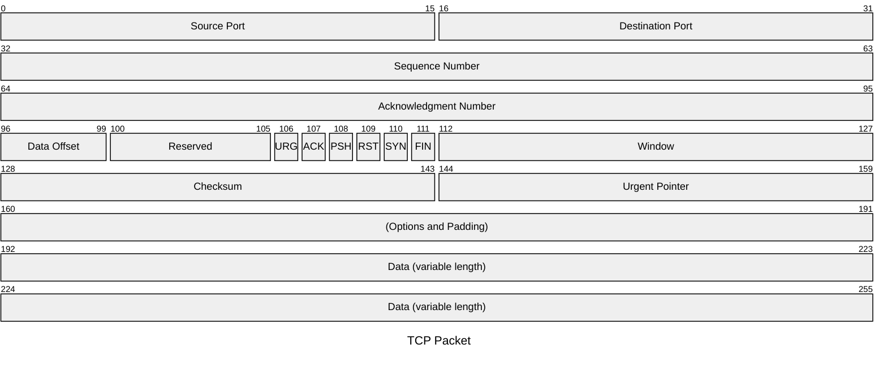
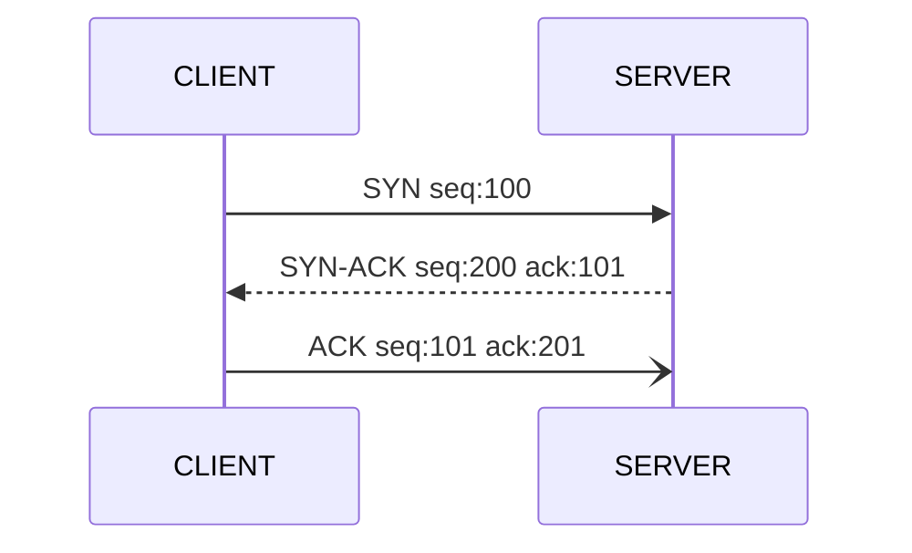

 # Notes on Linux networking


## Network concepts


### Machine interface

#### MAC address
 unique figerprint of the network interface
 
#### IP address
 Unique address on the network
 
#### Subnet
 Separates the IP into network and host address, and defines the size of the network
 
#### Gateway
  The connection leading outside of the local network
  
#### DNS host
 Translates hostname into IP addresses

#### DNS Domain 
 The lookup domain for the host

#### Commands
  The commands to identify the previous data are: ifconfig, ip, nmcli, routel. 

#### ifconfig

check `man ifconfig`. Take into account `ifconfig` is deprecated. 

`lo` the loopback interface, this is a virtual interface that the system uses to communicate with itself. 

#### ip

`ip address show` use this better than `ipconfig`

```bash
Show / manipulate routing, devices, policy routing and tunnels.
Some subcommands such as ip address have their own usage documentation.
More information: https://www.man7.org/linux/man-pages/man8/ip.8.html.

 - List interfaces with detailed info:
   ip address

 - List interfaces with brief network layer info:
   ip -brief address

 - List interfaces with brief link layer info:
   ip -brief link

 - Display the routing table:
   ip route

 - Show neighbors (ARP table):
   ip neighbour

 - Make an interface up/down:
   ip link set interface up/down

 - Add/Delete an IP address to an interface:
   ip addr add/del ip/mask dev interface

 - Add a default route:
   ip route add default via ip dev interface
```

#### nmcli - network manager cli

```bash
A command-line tool for controlling NetworkManager.
Some subcommands such as nmcli monitor have their own usage documentation.
More information: https://networkmanager.dev/docs/api/latest/nmcli.html.

 - Run an nmcli subcommand:
   nmcli agent|connection|device|general|help|monitor|networking|radio command_options

 - Display the current version of NetworkManager:
   nmcli --version

 - Display help:
   nmcli --help

 - Display help for a subcommand:
   nmcli subcommand --help
```
#### routel

The routel script will list routes in a format that some might consider easier to interpret then the ip route list equivalent.

#### Example

Check the system is running the network:

```bash
[cloud_user@ip-10-0-1-172 ~]$ systemctl status NetworkManager
● NetworkManager.service - Network Manager
   Loaded: loaded (/usr/lib/systemd/system/NetworkManager.service; disabled; vendor preset: enabled)
   Active: active (running) since Mon 2024-07-22 14:03:00 EDT; 1h 18min ago
     Docs: man:NetworkManager(8)
  Process: 1227 ExecReload=/usr/bin/dbus-send --print-reply --system --type=method_call --dest=org.freedesktop.NetworkManager /org/freedesktop/NetworkManager org.freedesktop.NetworkManager.Reload uint32:0 (code=exited, status=0/SUCCESS)
 Main PID: 1207 (NetworkManager)
   CGroup: /system.slice/NetworkManager.service
           ├─1207 /usr/sbin/NetworkManager --no-daemon
           └─1231 /sbin/dhclient -d -q -sf /usr/libexec/nm-dhcp-helper -pf /var/run/dhclient-ens5.pid -lf /var/lib/NetworkManager/dhclient-8126c120-a964-e959-ff98-ac4973344505-ens5.lease ...

Jul 22 14:56:28 ip-10-0-1-172.ec2.internal dhclient[1231]: DHCPACK from 10.0.1.1 (xid=0x45cf9bf2)
Jul 22 14:56:28 ip-10-0-1-172.ec2.internal NetworkManager[1207]: <info>  [1721674588.0944] dhcp4 (ens5):   address 10.0.1.172
Jul 22 14:56:28 ip-10-0-1-172.ec2.internal NetworkManager[1207]: <info>  [1721674588.0944] dhcp4 (ens5):   plen 24 (255.255.255.0)
Jul 22 14:56:28 ip-10-0-1-172.ec2.internal NetworkManager[1207]: <info>  [1721674588.0945] dhcp4 (ens5):   gateway 10.0.1.1
Jul 22 14:56:28 ip-10-0-1-172.ec2.internal NetworkManager[1207]: <info>  [1721674588.0945] dhcp4 (ens5):   lease time 3600
Jul 22 14:56:28 ip-10-0-1-172.ec2.internal NetworkManager[1207]: <info>  [1721674588.0945] dhcp4 (ens5):   hostname 'ip-10-0-1-172'
Jul 22 14:56:28 ip-10-0-1-172.ec2.internal NetworkManager[1207]: <info>  [1721674588.0945] dhcp4 (ens5):   nameserver '10.0.0.2'
Jul 22 14:56:28 ip-10-0-1-172.ec2.internal NetworkManager[1207]: <info>  [1721674588.0945] dhcp4 (ens5):   domain name 'ec2.internal'
Jul 22 14:56:28 ip-10-0-1-172.ec2.internal NetworkManager[1207]: <info>  [1721674588.0945] dhcp4 (ens5): state changed bound -> bound
Jul 22 14:56:28 ip-10-0-1-172.ec2.internal dhclient[1231]: bound to 10.0.1.172 -- renewal in 1497 seconds.
```

check for active connections: 

```bash
[cloud_user@ip-10-0-1-172 ~]$ nmcli c show
NAME         UUID                                  TYPE      DEVICE
System ens5  8126c120-a964-e959-ff98-ac4973344505  ethernet  ens5
System eth0  5fb06bd0-0bb0-7ffb-45f1-d6edd65f3e03  ethernet  --
```

check the connection on that device:

```bash
[cloud_user@ip-10-0-1-172 ~]$ nmcli d show ens5
GENERAL.DEVICE:                         ens5
GENERAL.TYPE:                           ethernet
GENERAL.HWADDR:                         0E:C8:C6:B7:DE:09
GENERAL.MTU:                            9001
GENERAL.STATE:                          100 (connected)
GENERAL.CONNECTION:                     System ens5
GENERAL.CON-PATH:                       /org/freedesktop/NetworkManager/ActiveConnection/1
WIRED-PROPERTIES.CARRIER:               on
IP4.ADDRESS[1]:                         10.0.1.172/24
IP4.GATEWAY:                            10.0.1.1
IP4.ROUTE[1]:                           dst = 0.0.0.0/0, nh = 10.0.1.1, mt = 100
IP4.ROUTE[2]:                           dst = 0.0.0.0/0, nh = 10.0.1.1, mt = 0
IP4.ROUTE[3]:                           dst = 10.0.1.0/24, nh = 0.0.0.0, mt = 0
IP4.ROUTE[4]:                           dst = 169.254.0.0/16, nh = 0.0.0.0, mt = 1002
IP4.ROUTE[5]:                           dst = 10.0.1.0/24, nh = 0.0.0.0, mt = 100
IP4.DNS[1]:                             10.0.0.2
IP4.DOMAIN[1]:                          ec2.internal
IP6.ADDRESS[1]:                         fe80::cc8:c6ff:feb7:de09/64
IP6.GATEWAY:                            --
IP6.ROUTE[1]:                           dst = fe80::/64, nh = ::, mt = 256
IP6.ROUTE[2]:                           dst = ff00::/8, nh = ::, mt = 256, table=255
```
So all the data needed is:

```bash
IP Address: 10.0.1.172
Netmask: 24
Gateway: 10.0.1.1
DNS Server:  10.0.0.2
DNS Domain: ec2.internal
```


### Network topology

#### Basic network topology 

A **switch** is a device desined for local area networking, the switch is connected to a **router (gateway)**  and the router is connected to the internet (external network). Routers have a routing table, so they are able to communicate with other routers. Routers forward packages between networks. 

#### OSI layers

We’ll describe OSI layers “top down” from the application layer that directly serves the end user, down to the physical layer.

##### 7. Application Layer

The application layer is used by end-user software such as web browsers and email clients. It provides protocols that allow software to send and receive information and present meaningful data to users. A few examples of application layer protocols are the Hypertext Transfer Protocol (HTTP), File Transfer Protocol (FTP), Post Office Protocol (POP), Simple Mail Transfer Protocol (SMTP), and Domain Name System (DNS).

##### 6. Presentation Layer

The presentation layer prepares data for the application layer. It defines how two devices should encode, encrypt, and compress data so it is received correctly on the other end. The presentation layer takes any data transmitted by the application layer and prepares it for transmission over the session layer. Examples: TLS, SSL, MIME, JPEG, GIF.  

##### 5. Session Layer

The session layer creates communication channels, called sessions, between devices. It is responsible for opening sessions, ensuring they remain open and functional while data is being transferred, and closing them when communication ends. The session layer can also set checkpoints during a data transfer—if the session is interrupted, devices can resume data transfer from the last checkpoint. Examples: 
LDAP, NetBios, PPTP, RPC, SMB, SSL. 

##### 4. Transport Layer

The transport layer takes data transferred in the session layer and breaks it into “segments” on the transmitting end. It is responsible for reassembling the segments on the receiving end, turning it back into data that can be used by the session layer. The transport layer carries out flow control, sending data at a rate that matches the connection speed of the receiving device, and error control, checking if data was received incorrectly and if not, requesting it again. Examples: TCP, UDP, SPX, iSCSI

##### 3. Network Layer

The network layer has two main functions. One is breaking up segments into network packets, and reassembling the packets on the receiving end. The other is routing packets by discovering the best path across a physical network. The network layer uses network addresses (typically Internet Protocol addresses) to route packets to a destination node. Examples: IP, IPSec, ICMP, RIP. 

##### 2. Data Link Layer

The data link layer establishes and terminates a connection between two physically-connected nodes on a network. It breaks up packets into frames and sends them from source to destination. This layer is composed of two parts—Logical Link Control (LLC), which identifies network protocols, performs error checking and synchronizes frames, and Media Access Control (MAC) which uses MAC addresses to connect devices and define permissions to transmit and receive data. Examples: Ethernet, FrameRelay, WiFi, PPP, VLAN, MAC. 

##### 1. Physical Layer

The physical layer is responsible for the physical cable or wireless connection between network nodes. It defines the connector, the electrical cable or wireless technology connecting the devices, and is responsible for transmission of the raw data, which is simply a series of 0s and 1s, while taking care of bit rate control.

### What are alternatives to the OSI model?

Today, the main alternative to the Open Systems Interconnection (OSI) model is the TCP/IP model.

The TCP/IP model is comprised of five different layers:
 - The physical layer
 - The data link layer
 - The network layer
 - The transport layer
 - They application layer
   
While layers like the physical layer, network layer, and application layer appear to map directly to the OSI model, this isn’t quite the case. Instead, the TCP/IP model most accurately maps to the structure and protocols of the internet.

The OSI model remains a popular networking model to describe how networking operates from a holistic perspective for educational purposes. However, the TCP/IP model is now more commonly used in practice.

#### Anatomy of an IP address

References:
 - https://en.wikipedia.org/wiki/IP_address
 - https://en.wikipedia.org/wiki/Classless_Inter-Domain_Routing
 - https://en.wikibooks.org/wiki/A-level_Computing/AQA/Computer_Components,_The_Stored_Program_Concept_and_the_Internet/Structure_of_the_Internet/IP_addresses
 - NAT: https://en.wikipedia.org/wiki/Network_address_translation

An IP address is the address of the system in a network. 

IPv4 is for example: 192.168.101.100, that is 4 8-bit numbers (from 0 to 255) named as octects, so it is a 32 bit address. 

IPv6 is for example: 1013:18bc:0000:0000:0000:00ff:99ad:313d - it is longer a 128-bit address. So it is made by 16 octects. The zeros can be removed, and the address will be expressed as:  1013:18bc::ff:99ad:313d. 

##### Classfull networking

 There are 5 traditional classes of networks: 

 | class | first bits pattern | coment | range | comment |
 |  -----------  |  -----------  |  -----------  |  -----------  |  -----------  |
 | Class A | 0--- | zero on the first bit of the first octect | 0.0.0.0 to 127.255.255.255 |  |
 | Class B | 10-- | one on the first bit and 0 on the second bit | 128.0.0.0 to 191.255.255.255 |  |
 | Class C | 110- |  | 192.0.0.0 to 223.255.255.255 |  |
 | Class D | 1110 |  | 224.0.0.0 to 239.255.255.255 |  Reserved for multicasting network | 
 | Class E | 1111 |  | 240.0.0.0 to 255.255.255.255 |  Reserved for experimental use |

  - Class A uses the fist octect to define the network and the rest of octects to define the hosts
     - `255.0.0.0 -> the mask is:  1111 1111 | 0000 0000 - 0000 0000 - 0000 0000`, 2097152 hostS IPs
  - Class B uses the fist two octects to define the netowork and the rest of octects to define the  hosts:
     - `255.255.0.0 -> the mask is: 1111 1111 - 1111 1111 | 0000 0000 - 0000 0000`, 65534 hosts IPS
  - Class c uses the fist three octects to define the netowork and the rest of octects to define the  hosts:
     - `255.255.255.0 -> the mask is: 1111 1111 - 1111 1111 - 1111 1111 | 0000 0000`,  254 hosts IPS


  Within classfull networks are some range reserved for private use:
   - Class A: 10.0.0.0 to 10.255.255.255
   - Class B: 172.16.0.0 to 173.31.255.255
   - Class C: 192.168.0.0 to 192.168.255.255

There is other range of reserved IP addresses for IPv4 addresses: 
 - 127.0.0.0 to 127.255.255.255 this is the loopback range

##### CIDR

Classfull networks are substitued by CIDR - **Classless Inter-domain Routing**

The mask number indicates the number of first bits, that will be masked to obtain the network part of the IP address.

In the case of IPv6, the address is divide into: 

```
    |      -----------      128 bits   -----------------|

    /-- global ---/ /Internal/
    1013:18bc:0000:   0000:      0000:0000:00ff:99ad:313d
    \------    etwork ------/   \-------  Node   --------/
                                   - derived from MAC addess 
```

there are 3 types of ipv6 addresses:
 - global unicast: Internet scope- starts with `2001:`
 - unique local: Internal network scope - not routed on the internet
 - link local: Network link scope - not routed on the internet. starts with `FE80:`

### Network Address Translation - NAT

NAT stands for **Network Address Translation** is a method for remapping on IP address space into another by modifying network address translation address inforamtion in the IP header of packets while they are in transit across a traffic routing device. 

####  Network flow

### Routing

 Router: a layer 3 device (working at IP level), a router forwards packets between networks. To forward those packages it uses **routing tables**, a routing table is a static table maping of the **best path** to a network destination. The routing table list destinations and gateways for the networks the host belongs to. 

To check for the routing table in Linux use: 
 - `ip route list`
 - `netstat -n`
 - `sudo route -n`

**static routes** are manually configured routes. they are used for traffic.

#### Routing::BGP

- referenece: https://www.cloudflare.com/learning/security/glossary/what-is-bgp/

**BGP** stands for Border Gateway Protocol, is the routing protocol used to route traffic across internet - this protocol is the one thing that allows the internet to work. 

BGP is a layer 4 protocol (transport layer, like TCP). There is no discovery, peers are configured manually to exchange routing information from a TCP connection. 

An **ASN** Autonomous System Number, is needed to implement BGP peering. This is a special number assigned by **IANA** ([Internet Assigned Numbers Authority](https://en.wikipedia.org/wiki/Internet_Assigned_Numbers_Authority)) for use primarily with BGP that identifies each network on the internet. Two routers that have established connection and exchange routing information are BGP peers, exchanging routing information between them via BGP sessions over TCP. 


### Address Resolution Protocol (ARP)

ARP is a communication protocol used for discovering the MAC address associated with a given network layer address (IP address). So ARP maps an IP address into a MAC address on a network. ARP maps layer 3 addresses to MAC layer 2 addresses. It is used for local are network connections. Connections outside the local area network, go through the gateway (ARP request for gateway IP). 

```

             ----------
                Data       - the data payload needing to be sent 
             ----------
                 |
                 |
             ----------
               LAYER 3    - The layer 3 is created with the source IP and destination IP
             ----------
                 |
                 |
             ----------
               LAYER 2    - The layer 2 header is created with the source MAC and destination (gateway) MAC
             ----------
                 |
                 |
             ----------
            ARP REQUEST   - If the destination MAC address isn't working a broadcast request is sent to the network
             ----------     If the destination IP is outside the local network, it will request the MAC of the default gateway.
                 |
                 |
             ----------
                SEND      - The datagram is send to the network for delivery
             ---------- 

```

To check for ARP tables use: 
 - the `arp` command
 - the `ip neigh` command

### Domain Name Service (DNS)

DNS is layer 7 protocol used for discovering the IP address associated with a given domain name. DNS maps a domain name to an IP address on the network. 

An FQDN (Fully Qualified Domain Name) is the complete domain name for a specific host on the network. When a computer wants to initiate a connection to an
FQDN, for example 'wwww.example.com', it needs to know where the host is on the network. The computer will send a query to the DNS server, asking it to resolve
the FQDN, to an IP address, and then looks at the routing table to determine where to send the request. 

The resolution of the name begins with the TLD (Top Level Domain) servers, and progress to the name server of the domain. 

To check for DNS, use the `dig` command, part of the `bind-utils` package. For example: `dig -4 www.linuxacademy.com  +trace`. 

### TCP handshake

TCP stands for Transmission Control Protocol, it is a layer 4 protocol, it is a highly reliable connection protocol through Positive Acknowledgement and Retransmission (PAR). 
Data is resend if an Acknowledgment is not received. The layer 4 data is referred as segments, and each segment contains a checksum for verification upon receipt. Segments
go inside of packages, and packages go inside of frames. If verification succeeds then the acknoledgment is sent. If verification fails, the received discards that segment, 
and waits for retransmission. 

- reference: https://medium.com/@kusal95/tcp-3-way-handshake-process-1fd9a056a2f4




SYN

SYN-ACK

ACK


### Packet flow

1 - The first step is the connection sequence, so if a host name is used, a DNS needs to be addressed, so a DNS query is send to determine the IP of the destination. 

2 - Needs to connect to the ARP table: an ARP request will be send if internal network devices need MAC addresses as part of this connection, unless tha tinformation is already in the ARP table.

3 - The TCP 3-way handshake will take place: SYN - SYN ACK - ACK

4 - The connection is done


### Virtual Private Network (VPN)

A VPN connection is an extension of private network, using the IP connectivity of the internet to connect remote clients to remote sites in an encrypted private connection.
 Reasons: 
  - secure private network traffic over an insecure public network
  - allow connections to an internal corporate resource from a remote location
  - to connect two separate private networks together (like office networks in different locations)
  - The routing table list destinantios and gateways for the networks a host belongs to.

For VPN, tunneling is used, tunneling allows the encapsulation of one type of protocol packing within the datagram of a different protocol for instance, sending TCP/IP traffic over the internet. 

For PPTP and layer two Tunneling Protocol (L2TP), a tunnel is similar to a session. Each end of the tunnel must agree to the tunnel connection, and will negociate configuration variables such as
address assignment, encryption and compression parameters. The mechanism used to create, mantain and end the tunnel is the tunnel management protocol. 

Only after the tunnel is established can data be send. When the tunnel client sends network data to the tunnel server, the tunnel client appends a tunnel data transfer protocol header to the payload. 
The client then sends the encapsulated (and usually encrypted) data to the tunnel server. The tunnel server accepts the data, removes the tunnel data, and forwards the payload to the destination network
within the VPN. 


   
## Machine level configuration

### Network interface

### Routing

### DNS


## Admin services and tools

### Firewalls

### Connection and troubleshooting


## Advanced user cases


### Port forwarding & redirection

### ssh tunneling 

### Proxy servers

### Load balancers

### VPN

### IDS


