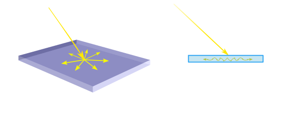
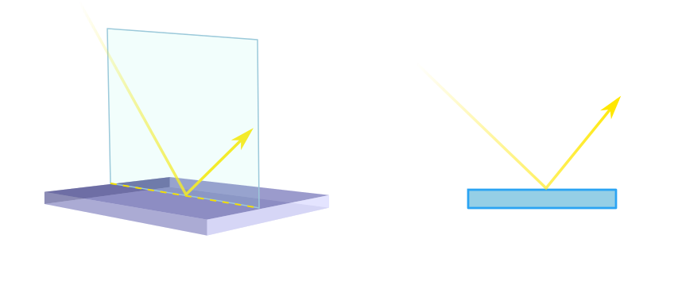

# Notes about light

What exactly is the light is something really difficult to define, and it took scientists quite a time to get the knowledge we have today. There are a 
actually three main models that are acknoledged for representing the light, being the simpliest and easiest to work with the ray-model, although it lacks correct explanation for some phenomenon. Anyway is a good place to start,  We will discuss this model next.

First of all, we may consider question: what make as to see the world?, what make us able to see?. Well the answer is pretty straight fodward, we
are able to see because there are objects that emitt light, as for example the Sun, or bulbs, although there are other kinds of light emission based on other principles as fluerescence, thermic as incandescence, ... 

So, we can consider that from a light emitting object, the light moves in straight rays outwards. The light moves straight but when it
finds a change in the enviroment it moves, as when it goes through air, and then it finds a window, it is a change in the material it goes
through, then three things can happen:

- transmission: the light travels through the new material
- absortion: the light diffusses through the material.
- reflection: the light "bounces", at the new material.

# Transmission:

# Absortion:

# Reflection:

SERGIO GONZALEZ COLLADO
