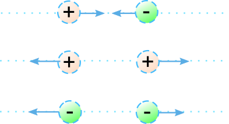

## What are things made of?
### ... or: what is the structure of matter?

 -- This is quite a topic! through history there has been several theories that tried to explain what the matter is made of. For the moment, is enought to consider the theory known as the **Atomic model** or  _**Bohr's model**_. This theory states that matter is ultimately made of particles known as **atoms**. Being the atoms:_the smallest elemental unit of matter_. And atoms are made of two parts: a _nucleus_ - made by two kinds of sub-particles: **protons** and **neutrons**; and kind of 'orbiting' 'cloud' around the nucleus, made of another kind of sub-particles, known as **electrons**. 

 

 

That means, that all the different elements known, are made of protons, neutrons and electrons, and they only differ in the number of protons, neutrons and electrons, their atoms are made of. 

_NOTE_ The existence of atoms, was first considered by the experiments of J.J. Thompson while working with cathodic rays and Crookes tubes.

## **Electric Charge:**
The electric charge,usually represented by its symbol **Q**, it is what in physics is refered as a **fundamental magnitude**, as for example are: the _longidude_ (SI unit: Meter), or the _force_ (SI unit: Newton) or the _mass_ (SI unit: Kg). It is a fundamental magnitude because it cannot be deduced from the others: Mass(M), Lenght(L), and time(T) ...

The electric charge cuantifies the **defect** of electrons (by convention this is known as *Positive charge*), or the **excess** of electrons (by convection this is known as *negative charge*) in a body, and it's unit in international system of units is the _**Coulomb**_, which is abbreviated with: **C**.

The Coulomb (C) is defined as the amount of electrical charge that have 6.241x1018 electrons.

The number of Coulombs per second (C/s) is known as the **Ampere** (A), which is the unit of the electric current. The electric current is the amount of electric charges that goes through a body per unit time - this is same as say: the flow of electric charges.

## **Electricity**: 
Electricity is an energy asociated with the phenomenon of the flow and/or accumulation of electric charges (excess or defect of electrons)

## **Electrostatics**:
Is the study of the electric phenomenon, when the different charges: electrons (by convention, negatively charged)
and protons (by convention, positive charged) are in an static equilibrium - that is: they are not moving with respect each others.

## Charge conservation's Law:
The net amount of charge is conserved, that is to say, that is the amount of positive charge, minus the net amount of negative charge
is always conserved. This implies that electric charge cannot be created nor destroyed.

## Law of attraction and repulsion: forces between charges
Two charges of equal sign, repulse each other, and two charges of opposite sign attract each other.
 
 
 
 

 
 

## Types of materials:

 According how electric charges (the defect or excess of electrons) behave in a given material, it is possible to differentiate two classes of materials: conductor,  non-conductors and semi-conductors.
 
### Conductor materials
 
In Conductor materials the unions or bonds between atoms are such that they share the outmost 'orbiting' electrons. Due to this the electric charges, can move fairly easily in the material, that means that they will distribute themselves evenly in the material.

Due to the fact that electric charges with the same sign repulse each other, in a given charged body, its electric charges will place themselves in it's outer surface, as result of repelling each other, and being in its out-most surface is the placement in which the charges are most distanced one of each other.

Most common conductor materials are: metals.
 
### Non-conductor materials: Insulators
  
In non-conductor materials, the electrons are tightly bond to their nucleus. As such, the electric charges, can not easily move in the material, as consecuence, the electric charges will tend to be concentrated on a point or small region (due its lack of movement).

Most common non-conductor materials are: plastics, rubbers and wood (dry).

### Semi-conductors

There is another type of material related to its classification according to the behavior of electric charges in it: the semi-conductors, these materials change its conductivity, that is the easiness which the elecytric charges move throught it, depending
on certain conditions.... the most common example of this type of material is the Silicon.

## How things can get electrically charged

there are three main ways:

- by **contact** or **friction**: this is known as **triboelectric effect**, this is usually a process to charge non-conductive materials or insulators. 

- by **conduction**: this usually works fine with conductive materials... if an object touch something that is already charged, that
charge is distributed between the two objects, due the charge is transferred and distributed.

- by **induction**: a charged objet is used, and a not charged object is presented close to it, but with-out touching it... also useful for charging metals and other conductors. Again, a charged object is used, but this time it is only brought close to the conductor, and does not touch it. If the conductor is connected to ground (ground is basically anything neutral that can give up electrons to, or take electrons from, an object), electrons will either flow on to it or away from it. When the ground connection is removed , the conductor will have a charge opposite in sign to that of the charged object.

 - by **ionization radiation**: as elements that are radiated with X-rays.

- **Piezoelectric effect**: wip..

- **Pieroelectric effect**: wip...

## **Electrostatics Force: the Coulomb's Law**

Electrostatics are govern by _**Coulomb's Law**_ that enunciates as folows:

The force **F** between two charged particles (Q 1 and Q 2) in static equilibrium, in a given medium,
its proportional to the product of their charges, and inversely proportional o the square of their distance (R2). 
If Q 1 and Q 2 have the same sign, that is: both positive or both negative, the force will be of
repulsion, driving them appart. If Q 1  and Q_2 have opposite signs, the force will be of attraction. 
That force will act always along the line that is defined by the position of both charged particles
Q 1 and Q 2 (vector **r**).

 
That force will be also proportional to a constant k e, in the International System of units (SI), it has the value:
 
 

 
     
Where **ε** is the absolutely permittivity of the medium (althought for symplicity many times is just 
call _**permittivity**_, for short); the absolutely permittivity value is given by:

 

 
    
where:

- **ε r** is a dimension-less quantity, that is known as the **relative permittivity** or also as the **dielectric constant**
 of the medium.
- **ε 0** is the permittivity of free space (vacuum) - and its value is:

 

 

So for free space, the relative permittivity is ε r = 1.

Then the force between the two charges Q 1 and Q 2, is defined by:

 

 

 

 

 - vector **r 1** is the position vector of Q 1
 - vector **r 2** is the position vector of Q 2
 - vector **r** is the relative positon of Q 2 related to Q 1
 - and the unitary vector in the vector **r** direction is:
 

 
 

 

 

One point to notice about this formula, is that it depends on an irrational number 'pi', a simplification exists that allows us to 'rationalize' this formula:

 

 

So in practice the following formula is used:

 

 

k e has units of: N·m2/C2.

A good point, is that is possible to use the superposition principle with these forces, that meaning: that the total force is the sum of all the forces in the object. 

 

 

### Example calculation

#### 1
We are given a charge Q 1 of +1C value and another charge Q 2 of +2C at 1m at its right. What is the force at Q 2.

F = K · Q 1 · Q 2/ d1^2 = 9· 10^9 · 1C · 2C / 1m^2 = 18 · 10^9 Newtons (the force is of repulsion due the charges
have the same sign)

#### 2
If the distance is doubled between Q 1 and Q2, how much will be the force:

F = k · Q 1 · Q 2 / (2·d1)^2 = 900 · 1C · 2C / (2m)^2 = 9· 10^9 · 1C · 2C / 4 =  18· 10^9 /4 = 4.8 · 10^9

(the force is of repulsion due the charges have the same sign)

... We can obvserve that the force strengh has been reduced by a factor of 4, when the distance is just doubled. ... of course
this is due, that the strenght of the force is inverse proportional to the square of the distance between charges

#### 3
What would happen if we were to triple the distance between charges?

then the force would be 9 times the first force due that the force is inverse to the squared distance. F3 = 1/9 · F1

F = k · Q 1 · Q 2 / (3·d1)^2 = 900 · 1C · 2C / (3m)^2 = 9· 10^9 · 1C · 2C / 9 =  18· 10^9 / 9 = 2 · 10^9 

**Note:** Actually 1 Coulomb is a really big amount of electric charge, it has been used here, to easily illustratate the concepts and 
nature of coulomb forces, without including more challenging numbers.

#### 4
the Hidrogen [H] is the simplest element, is is made from a Proton (mass= 1.7·10^-27 kg) and an orbiting electron (mass=9.1·10^-31) 
both of them have a charge of aprox: 1.6·10-19 C. And its average distance is around 5.3·10^-11 m. What is the electrostatic
force between them?

F_c = k_e · Qp · Qe / d^2 = 9·10^9 · 1.6·10^-19 · (-1)·1.6·10^-19 / (5.3·10^-11)^2 = ... = -8.2 · 10-8 N (Attractive)

If we calculate its gravitational pull, what would be the force between them:

F_g = G · Mp · Me / d^2 = 6.67·10^-11 · 1.7·10^-27 · 9.1·10^31 / (5.3·10^-11)^2 = 3.6·10-47 N 

If we compare the ratio, we can see that the electrostatic force significant bigger.

[the neutron has been left out, in the gravity force calculation]

TODO: NOTES ON ESPECTROSCOPE...

## Electric Field

 Once we know the forces that electric charges exert one on each others, the concept of a force field is develop. 
 
 ### Force field: 
 Is the region of the space where forces can be perceived. Usually a force field is represented visually as a map of forces (as a vector). A force field can be expressed mathematically as the vector function of the forces over an element for a given position.
 
 ### Electric Force field:
Is the force field over the space, caused by Coulomb forces (electrostatic forces), over a charge of value the unit 1 Coulomb. The 1 Coulomb charge definition is due this is the same as using the force per unit of charge.
 
 So according to this definition we can consider the Electric Field, represented by **E**, for a given point charge, of value Q as:
 
 

 

The units of the Electric Field are Newtons per Coulomb [N/C].

It is easy to calculate the electric field due to charge **q**, if we know the force in that charge.

 

 

The other way around is also frequent, if the electric field is known, to deduce the force in a charge **q**, is done by appling:

 

 

A nice thing, is that the electric field, allows us to use the superposition principle.
 
  

 
 
Here, is the strong point of the concept of "force field", given a chage distribution, it's electric field is easily known as it is
the sum of all the electric fields of each individual charge. And thus it is easy to calculate the net force exerted at any point, due
to the definition of electric field is equal to **q** times the electric force field at that point.

 

 

## Field lines

 Is common to represent the influence of a electric field by a drawing of its 'field lines', those lines represent the direction in which a positive field charge would if placed in that electric field.
 
 The electric lines always comply with: 
  - They always start in positive charged particles (sources)
  - They always end in negative charged particles (sinks)
  - Electric lines never cross each other
  - The density of the electric lines is proportional to the strengh of the electric field
  - The field lines are always tangent to the electric field at each of their points.x
  
  
 

 

  
 
 
 
 
 
 
 
 
 
 
 
 
 
 
 
 
 
 
 
 
 
 

𝓢ℯ𝓇ℊ𝒾ℴ 𝓖. 𝓒ℴ𝓁𝓁𝒶𝒹ℴ

REFERENCES:

https://courses.lumenlearning.com/physics/chapter/19-5-capacitors-and-dielectrics/
https://www.doitpoms.ac.uk/tlplib/thermal_electrical/printall.php

http://demoweb.physics.ucla.edu/content/experiment-3-electrostatics

https://courses.lumenlearning.com/physics/

http://web.lemoyne.edu/~GIUNTA/papers.html

https://www.doitpoms.ac.uk/tlplib/dielectrics/intro.php

http://www.cabrillo.edu/~jmccullough/Physics/Electric_Forces_Fields.html

https://kaiserscience.wordpress.com/physics/electromagnetism/electrostatics/

https://www.norwellschools.org/cms/lib02/MA01001453/Centricity/Domain/63/Electrostatics%20-%20Coulombs%20Law%20period%206.pdf

http://www.physics.usyd.edu.au/super/life_sciences/E/E-all.pdf

http://www.physicstutorials.org/home/electrostatics/electrical-forces-coulombs-law/99-electroscope

TODO:

Seminar work of Michael Faraday:

https://en.wikisource.org/wiki/Experimental_researches_in_electricity

Check:  The Geiger-Marsden experiment

Check: https://en.wikipedia.org/wiki/Crookes_tube

Check: HerriotT Cell, on spectroscopy as in the Mars Curiosity rober.

out Einstein's theoretical explanation for the observed Brownian motion and the observed Perrin experiments on it are quite valid.

Rutherford's alpha particle scattering experiments

Rutherford and Rayleigh and Einstein--Perrin and the Millikan oil-drop experiment might be the best experimental verification of atomic theory.

here is an experiment by Perrin related to this which has been pivotal in the acceptance of the atomic hypothesis. I think Perrin got the Nobel Prize

check example of how a printer works...

ref:  http://physics.bu.edu/~duffy/PY106/Charge.html

## Why shocks and sparks of electrostatic electricity are more notable in winter?

Mostly because the air is much drier in winter that in summer. The dry air is a better isolator that air wit more humidity, so f something is charged, it tends to stay charged, as it is not able to discharge. In an air with more humiditi, 6that is wter, that is a polar molecule, it much easier to discharge the static electricity in our bodies. 

There are other factors, as for example in winter we use to wear more clothes and put the on, and remove then, this usually increase our charge ty means of triboelectric effect. Also the type of shoes affets us, usually boots with rubber soles, isolates our body much better. ...

## Why water is so good disolvent?

It happens that the water molecule H 2 Om, is a polar molecule, that means that it has polarities .. the same as a battery. the water molecule overall electrostatic charge is zero, but at one side it has the possitive charge, and at other the negative charge.

## Electrostatic applications

- Electrostatic spray painting
- Electrostatic precipitation
- Electrostatic Mics and loudspeakers
- Xerography
- Ion motors
- Pararayos
- Electrostatic deflection 
   - http://chair.pa.msu.edu/applets/E-Deflection/a.htm
   - https://circuitglobe.com/electrostatic-deflection-in-crt.html
- Safety: Hindernburg 
   - https://en.wikipedia.org/wiki/Hindenburg_disaster
   - ESD
- Storms: https://www.school-for-champions.com/science/static_lightning.htm#.WvNgT4jRDIU
 
 https://en.wikipedia.org/wiki/Triboelectric_effect  

more resources to check:

https://www.school-for-champions.com/science/static_resources.htm#.WvNiH4jRDIU

https://www.school-for-champions.com/science/static_resources.htm#.WvNiH4jRDIU

https://www.amazon.com/Science-Wiz-ScienceWiz-Charge-Activity/dp/B00HFGJATE/ref=sr_1_7?s=books&ie=UTF8&qid=1525899874&sr=8-7&keywords=Static+Shock+ring

https://www.amazon.com/gp/search?ie=UTF8&camp=1789&creative=9325&index=books&keywords=Electrostatics&linkCode=ur2&tag=schoolforchampio

https://www.bbc.com/education/examspecs/zwtp6fr

https://web.pa.msu.edu/courses/2000fall/phy232/lectures/index.html

Simulation

- http://mw.concord.org/modeler/showcase/index.html

- http://mw.concord.org/modeler1.3/mirror/electrostatics/electroscope.html

