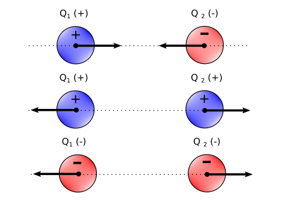

## **Electric Charge:**
The electric charge, represented by its symbol **Q**,  is a fundamental magnitude, as for example the longidude (SI unit: Meter), or the force (SI unit: Newton). Its a fundamental magnitude, as it cannot be deduced from the others: Mass(M), Lenght(L), and time(T) ...

The electric charge cuantifies the defect of electrons (by convection this is known as *Positive charge*), or the excess of electrons (by convection this is known as *negative charge*) in a body, and its unit in SI is the *Coulomb*.

The Coulomb (C) is the amount of electrical charge that have 6.241x10^18 electrons.

The number of Coulobs per second (C/s) = Ampere (A), which is the unit of the electric current, so current is the amount of electric charge that goes through a body per unit time.

## **Electricity**: 
Electricity is an energy asociated with the phenomenon of the flow and accumulation of electrons (negative charged particles)
oposed to protons (positive charged particles).

## **Electrostatics**:
Is the study of the electric phenomenon, when the different charges: electrons (by convention, negatively charged)
and protons (by convention, positive charged) are in an static equilibrium - that is: they are not moving with respect each others.

## Charge conservation's Law:
The net amount of charge is conserved, that is to say, that is the amount of positive charge, minus the net amount of negative charge
is always conserved. This implies that electric charge cannot be created nor destroyed.

## Law of attraction and repulsion:
Two charges of equal sign, repulse each other, and two charges of opposite sign attract each other.
 

 
 

Electrostatics is govern by _**Coulomb's Law**_ that enunciates as folows:

## **Coulomb's Law**

The force **F** between two charged particles (Q_1 and Q_2) in static equilibrium, in a given medium,
is proportional to the product of it's charges, and inversely proportional o the square of it's distance (R^2). 
If Q_1 and Q_2 have the same sign, that is: both positive or both negative, the force will be of
repulsion, driving them appart. If Q_1 and Q_2 have opposite signs, the force will be of attraction. 
That force will act always along the line that is defined by the position of both charged particles
Q_1 and Q_2 (vector r). That force will be also proportional to a constant **k_e**, in the Internationa
System of units, **SI**, it has the value:

 

 
     
Where **ε** is the absolutely permittivity of the medium (althought for symplicity many times is just 
call _**permittivity**_, for short); the absolutely permittivity value is given by:

 

 
    
where:

- **ε_r** is a dimension-less quantity, that is known as the **relative permittivity** or also as the **dielectric constant**
 of the medium.
- **ε_0** is the permittivity of free space (vacuum) - and its value is:

 

 

So for free space, the relative permittivity is ε_r = 1.

Then the force between the two charges Q_1 and Q_2, is defined by:

 

 

 

## Electric Field

 Once we know the forces that electric charges exert one on each others, the concept of a force field is develop. 
 
 Force field: 
 Is the map of forces (as a vector magnitude), over a given particle, and which is not enough as to modify the rest of the system -so
 its influence is infinitesimal-
 
 Electric Force field:
 Is the force field over the space, caused by Coulomb forces (electrostatic forces), over a charge of value the unit  1 Coulomb. This
 is the same as the force per unit of charge.
 
 So according to this definition we can consider the Electric Field, represented by **E**, for a given point charge, of value Q as:
 
 

 
 
 
 
  
 
 
 
 
 
 
 
 
 
 
 
 
 
 
 
 
 
 
 
 
 
 

𝓢ℯ𝓇ℊ𝒾ℴ 𝓖. 𝓒ℴ𝓁𝓁𝒶𝒹ℴ
